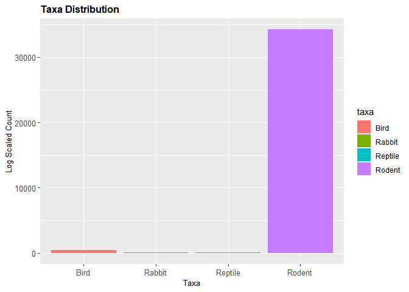
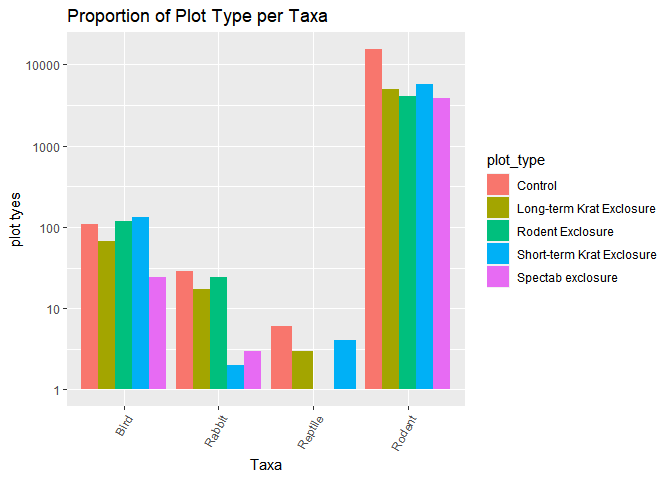
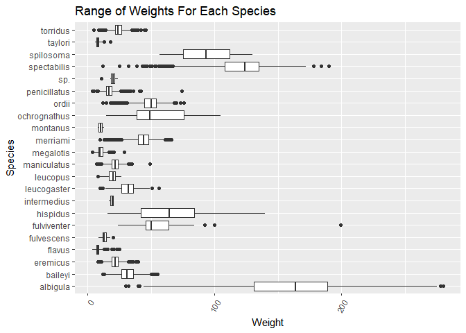
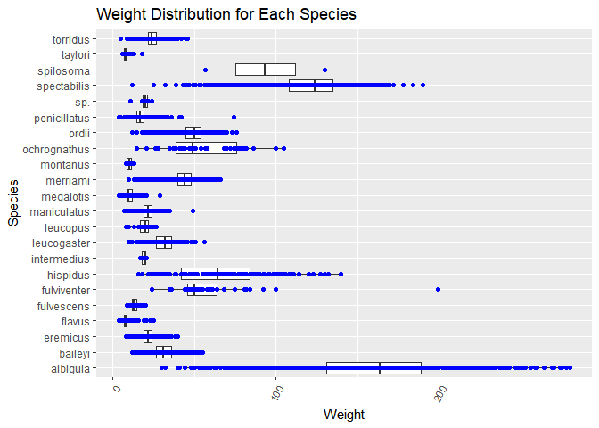
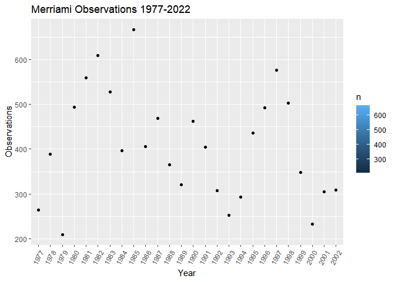
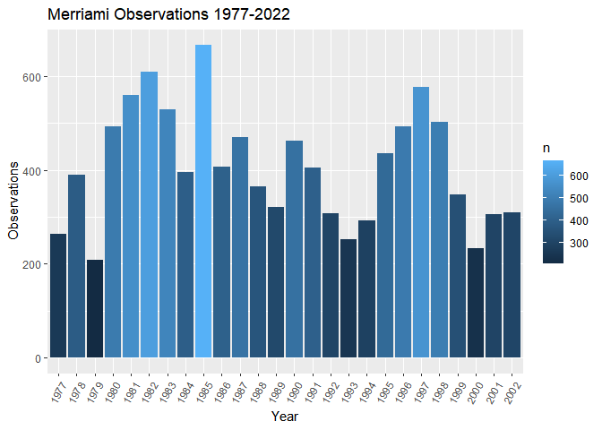
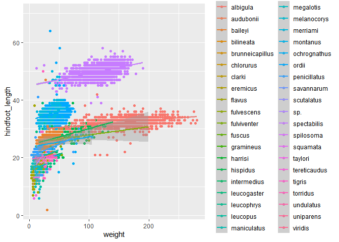
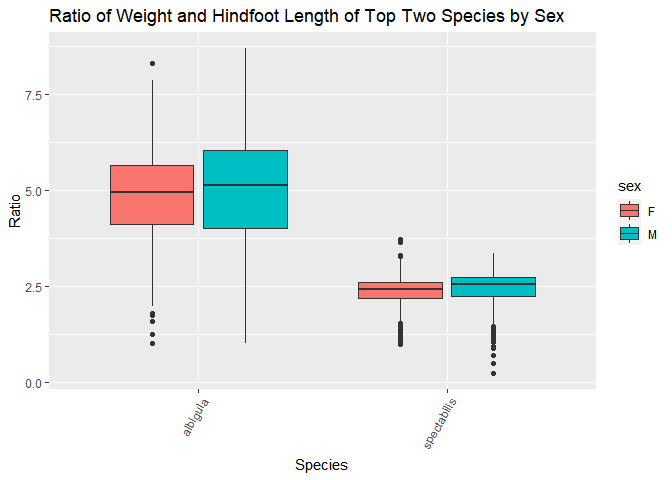
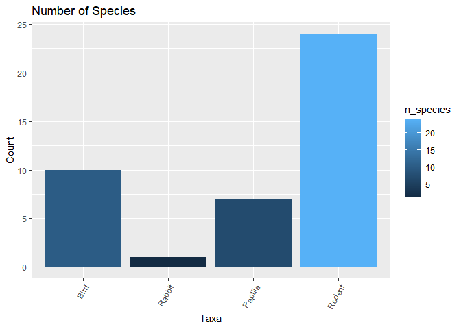
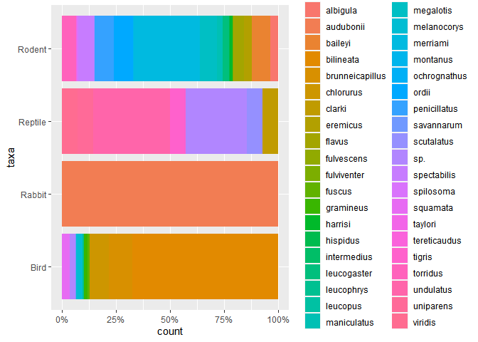

## Instructions
Answer the following questions and complete the exercises in RMarkdown. Please embed all of your code and push your final work to your repository. Your final lab report should be organized, clean, and run free from errors. Remember, you must remove the `#` for the included code chunks to run. Be sure to add your name to the author header above. For any included plots, make sure they are clearly labeled. You are free to use any plot type that you feel best communicates the results of your analysis.  

Make sure to use the formatting conventions of RMarkdown to make your report neat and clean!  

## Load the libraries

```r
library(tidyverse)
library(janitor)
library(here)
library(naniar)
```

## Desert Ecology
For this assignment, we are going to use a modified data set on [desert ecology](http://esapubs.org/archive/ecol/E090/118/). The data are from: S. K. Morgan Ernest, Thomas J. Valone, and James H. Brown. 2009. Long-term monitoring and experimental manipulation of a Chihuahuan Desert ecosystem near Portal, Arizona, USA. Ecology 90:1708.

```r
deserts <- read_csv(here("lab10", "data", "surveys_complete.csv"))
```

```
## Rows: 34786 Columns: 13
```

```
## -- Column specification --------------------------------------------------------
## Delimiter: ","
## chr (6): species_id, sex, genus, species, taxa, plot_type
## dbl (7): record_id, month, day, year, plot_id, hindfoot_length, weight
```

```
## 
## i Use `spec()` to retrieve the full column specification for this data.
## i Specify the column types or set `show_col_types = FALSE` to quiet this message.
```

1. Use the function(s) of your choice to get an idea of its structure, including how NA's are treated. Are the data tidy?

```r
dim(deserts)
```

```
## [1] 34786    13
```


```r
glimpse(deserts)
```

```
## Rows: 34,786
## Columns: 13
## $ record_id       <dbl> 1, 2, 3, 4, 5, 6, 7, 8, 9, 10, 11, 12, 13, 14, 15, 16,~
## $ month           <dbl> 7, 7, 7, 7, 7, 7, 7, 7, 7, 7, 7, 7, 7, 7, 7, 7, 7, 7, ~
## $ day             <dbl> 16, 16, 16, 16, 16, 16, 16, 16, 16, 16, 16, 16, 16, 16~
## $ year            <dbl> 1977, 1977, 1977, 1977, 1977, 1977, 1977, 1977, 1977, ~
## $ plot_id         <dbl> 2, 3, 2, 7, 3, 1, 2, 1, 1, 6, 5, 7, 3, 8, 6, 4, 3, 2, ~
## $ species_id      <chr> "NL", "NL", "DM", "DM", "DM", "PF", "PE", "DM", "DM", ~
## $ sex             <chr> "M", "M", "F", "M", "M", "M", "F", "M", "F", "F", "F",~
## $ hindfoot_length <dbl> 32, 33, 37, 36, 35, 14, NA, 37, 34, 20, 53, 38, 35, NA~
## $ weight          <dbl> NA, NA, NA, NA, NA, NA, NA, NA, NA, NA, NA, NA, NA, NA~
## $ genus           <chr> "Neotoma", "Neotoma", "Dipodomys", "Dipodomys", "Dipod~
## $ species         <chr> "albigula", "albigula", "merriami", "merriami", "merri~
## $ taxa            <chr> "Rodent", "Rodent", "Rodent", "Rodent", "Rodent", "Rod~
## $ plot_type       <chr> "Control", "Long-term Krat Exclosure", "Control", "Rod~
```

```r
summary(deserts)
```

```
##    record_id         month             day            year         plot_id     
##  Min.   :    1   Min.   : 1.000   Min.   : 1.0   Min.   :1977   Min.   : 1.00  
##  1st Qu.: 8964   1st Qu.: 4.000   1st Qu.: 9.0   1st Qu.:1984   1st Qu.: 5.00  
##  Median :17762   Median : 6.000   Median :16.0   Median :1990   Median :11.00  
##  Mean   :17804   Mean   : 6.474   Mean   :16.1   Mean   :1990   Mean   :11.34  
##  3rd Qu.:26655   3rd Qu.:10.000   3rd Qu.:23.0   3rd Qu.:1997   3rd Qu.:17.00  
##  Max.   :35548   Max.   :12.000   Max.   :31.0   Max.   :2002   Max.   :24.00  
##                                                                                
##   species_id            sex            hindfoot_length     weight      
##  Length:34786       Length:34786       Min.   : 2.00   Min.   :  4.00  
##  Class :character   Class :character   1st Qu.:21.00   1st Qu.: 20.00  
##  Mode  :character   Mode  :character   Median :32.00   Median : 37.00  
##                                        Mean   :29.29   Mean   : 42.67  
##                                        3rd Qu.:36.00   3rd Qu.: 48.00  
##                                        Max.   :70.00   Max.   :280.00  
##                                        NA's   :3348    NA's   :2503    
##     genus             species              taxa            plot_type        
##  Length:34786       Length:34786       Length:34786       Length:34786      
##  Class :character   Class :character   Class :character   Class :character  
##  Mode  :character   Mode  :character   Mode  :character   Mode  :character  
##                                                                             
##                                                                             
##                                                                             
## 
```

_Summarize NA's_

```r
deserts%>%
  summarise_all(~(sum(is.na(.))))%>%
  pivot_longer(everything(), names_to="variables", values_to="num_nas")%>%
  arrange(desc(num_nas))
```

```
## # A tibble: 13 x 2
##    variables       num_nas
##    <chr>             <int>
##  1 hindfoot_length    3348
##  2 weight             2503
##  3 sex                1748
##  4 record_id             0
##  5 month                 0
##  6 day                   0
##  7 year                  0
##  8 plot_id               0
##  9 species_id            0
## 10 genus                 0
## 11 species               0
## 12 taxa                  0
## 13 plot_type             0
```

```r
naniar::miss_var_summary(deserts)
```

```
## # A tibble: 13 x 3
##    variable        n_miss pct_miss
##    <chr>            <int>    <dbl>
##  1 hindfoot_length   3348     9.62
##  2 weight            2503     7.20
##  3 sex               1748     5.03
##  4 record_id            0     0   
##  5 month                0     0   
##  6 day                  0     0   
##  7 year                 0     0   
##  8 plot_id              0     0   
##  9 species_id           0     0   
## 10 genus                0     0   
## 11 species              0     0   
## 12 taxa                 0     0   
## 13 plot_type            0     0
```


```r
deserts
```

```
## # A tibble: 34,786 x 13
##    record_id month   day  year plot_id species_id sex   hindfoot_length weight
##        <dbl> <dbl> <dbl> <dbl>   <dbl> <chr>      <chr>           <dbl>  <dbl>
##  1         1     7    16  1977       2 NL         M                  32     NA
##  2         2     7    16  1977       3 NL         M                  33     NA
##  3         3     7    16  1977       2 DM         F                  37     NA
##  4         4     7    16  1977       7 DM         M                  36     NA
##  5         5     7    16  1977       3 DM         M                  35     NA
##  6         6     7    16  1977       1 PF         M                  14     NA
##  7         7     7    16  1977       2 PE         F                  NA     NA
##  8         8     7    16  1977       1 DM         M                  37     NA
##  9         9     7    16  1977       1 DM         F                  34     NA
## 10        10     7    16  1977       6 PF         F                  20     NA
## # ... with 34,776 more rows, and 4 more variables: genus <chr>, species <chr>,
## #   taxa <chr>, plot_type <chr>
```
Yes, the data are tidy!

(1) each variable has its own column YES
(2) each observation has its own row YES
(3) each value has its own cell YES

```r
names(deserts)
```

```
##  [1] "record_id"       "month"           "day"             "year"           
##  [5] "plot_id"         "species_id"      "sex"             "hindfoot_length"
##  [9] "weight"          "genus"           "species"         "taxa"           
## [13] "plot_type"
```


2. How many genera and species are represented in the data? What are the total number of observations? Which species is most/ least frequently sampled in the study?

Merriami is the most frequently sampled species. 
Tereticaudus is the least frequently sampled species. 


```r
deserts%>%
  group_by(genus)%>%
  summarise(n=n())%>%
  arrange(desc(n))
```

```
## # A tibble: 26 x 2
##    genus                n
##    <chr>            <int>
##  1 Dipodomys        16167
##  2 Chaetodipus       6029
##  3 Onychomys         3267
##  4 Reithrodontomys   2694
##  5 Peromyscus        2234
##  6 Perognathus       1629
##  7 Neotoma           1252
##  8 Ammospermophilus   437
##  9 Amphispiza         303
## 10 Spermophilus       249
## # ... with 16 more rows
```

```r
deserts%>%
  group_by(species)%>%
  summarise(n=n())%>%
  arrange(desc(n))
```

```
## # A tibble: 40 x 2
##    species          n
##    <chr>        <int>
##  1 merriami     10596
##  2 penicillatus  3123
##  3 ordii         3027
##  4 baileyi       2891
##  5 megalotis     2609
##  6 spectabilis   2504
##  7 torridus      2249
##  8 flavus        1597
##  9 eremicus      1299
## 10 albigula      1252
## # ... with 30 more rows
```

```r
deserts%>%
  summarise(n_genera=n_distinct(genus), n_species=n_distinct(species), n_total=n())
```

```
## # A tibble: 1 x 3
##   n_genera n_species n_total
##      <int>     <int>   <int>
## 1       26        40   34786
```


```r
deserts%>%
  count(species_id)%>%
  arrange(desc(n))
```

```
## # A tibble: 48 x 2
##    species_id     n
##    <chr>      <int>
##  1 DM         10596
##  2 PP          3123
##  3 DO          3027
##  4 PB          2891
##  5 RM          2609
##  6 DS          2504
##  7 OT          2249
##  8 PF          1597
##  9 PE          1299
## 10 NL          1252
## # ... with 38 more rows
```

3. What is the proportion of taxa included in this study? Show a table and plot that reflects this count.

```r
deserts%>%
  count(taxa)
```

```
## # A tibble: 4 x 2
##   taxa        n
##   <chr>   <int>
## 1 Bird      450
## 2 Rabbit     75
## 3 Reptile    14
## 4 Rodent  34247
```


```r
deserts%>%
  ggplot(aes(x=taxa, fill=taxa))+geom_bar()+scale_y_log10()+labs(title="Taxa Distribution", x="Taxa", y="Log Scaled Count")+theme(plot.title = element_text(size = 12, face = "bold"),
        axis.text = element_text(size = 10),
        axis.title = element_text(size = 10))
```

<!-- -->


4. For the taxa included in the study, use the fill option to show the proportion of individuals sampled by `plot_type.`

```r
deserts%>%
  ggplot(aes(x=taxa,  fill=plot_type))+geom_bar(position="dodge")+ scale_y_log10()+ labs(title="Proportion of Plot Type per Taxa", x="Taxa", fill="plot tyes")+  theme(axis.text.x = element_text(angle = 60, hjust = 1)) 
```

<!-- -->

5. What is the range of weight for each species included in the study? Remove any observations of weight that are NA so they do not show up in the plot.
_Range of Weight Displayed In Boxplot_

```r
deserts%>%
  filter(!is.na(weight))%>%
  select(species, weight)%>%
  ggplot(aes(x=species,y=weight))+geom_boxplot()+labs(title="Range of Weights For Each Species", x="Species", y="Weight")+coord_flip()+theme(axis.text.x = element_text(angle = 60, hjust = 1))
```

<!-- -->

6. Add another layer to your answer from #4 using `geom_point` to get an idea of how many measurements were taken for each species.

```r
deserts%>%
  filter(!is.na(weight))%>%
  ggplot(aes(x=species, y=weight))+geom_boxplot()+geom_point(position="dodge", color="blue")+coord_flip()+labs(title="Weight Distribution for Each Species", x= "Species", y="Weight")+theme(axis.text.x = element_text(angle = 60, hjust = 1))
```

```
## Warning: Width not defined. Set with `position_dodge(width = ?)`
```

<!-- -->

7. [Dipodomys merriami](https://en.wikipedia.org/wiki/Merriam's_kangaroo_rat) is the most frequently sampled animal in the study. How have the number of observations of this species changed over the years included in the study?

```r
merriami<-deserts%>%
  filter(species=="merriami")%>%
  group_by(year)%>%
  summarize(n=n())
merriami
```

```
## # A tibble: 26 x 2
##     year     n
##    <dbl> <int>
##  1  1977   264
##  2  1978   389
##  3  1979   209
##  4  1980   493
##  5  1981   559
##  6  1982   609
##  7  1983   528
##  8  1984   396
##  9  1985   667
## 10  1986   406
## # ... with 16 more rows
```

```r
merriami%>%
  ggplot(aes(x=as.factor(year), y=n, fill=n))+geom_point()+theme(axis.text.x = element_text(angle = 60, hjust = 1))+labs(title="Merriami Observations 1977-2022", x= "Year", y="Observations")
```

<!-- -->


```r
merriami%>%
  ggplot(aes(x=as.factor(year), y=n, fill=n))+geom_col()+theme(axis.text.x = element_text(angle = 60, hjust = 1))+labs(title="Merriami Observations 1977-2022", x= "Year", y="Observations")
```

<!-- -->


8. What is the relationship between `weight` and `hindfoot` length? Consider whether or not over plotting is an issue.
Overplotting is an issue because we see a lot of dots that overlap with each other. 

```r
deserts%>%
  ggplot(aes(x=weight,y=hindfoot_length))+geom_point()+geom_smooth(method=lm, se=T)
```

```
## `geom_smooth()` using formula 'y ~ x'
```

```
## Warning: Removed 4048 rows containing non-finite values (stat_smooth).
```

```
## Warning: Removed 4048 rows containing missing values (geom_point).
```

<!-- -->


9. Which two species have, on average, the highest weight? Once you have identified them, make a new column that is a ratio of `weight` to `hindfoot_length`. Make a plot that shows the range of this new ratio and fill by sex.

```r
deserts%>%
  filter(!is.na(weight))%>%
  group_by(species)%>%
  summarise(mean_weight=mean(weight))%>%
  arrange(desc(mean_weight))
```

```
## # A tibble: 22 x 2
##    species      mean_weight
##    <chr>              <dbl>
##  1 albigula           159. 
##  2 spectabilis        120. 
##  3 spilosoma           93.5
##  4 hispidus            65.6
##  5 fulviventer         58.9
##  6 ochrognathus        55.4
##  7 ordii               48.9
##  8 merriami            43.2
##  9 baileyi             31.7
## 10 leucogaster         31.6
## # ... with 12 more rows
```

```r
deserts%>%
  filter(species %in% c("albigula","spectabilis"),!is.na(weight),!is.na(hindfoot_length), !sex=="NA")%>%
  mutate(ratio=weight/hindfoot_length)%>%
  ggplot(aes(x=species,fill=sex, y=ratio))+geom_col(position="dodge")+theme(axis.text.x = element_text(angle = 60, hjust = 1))+labs(title="Ratio of Weight and Hindfoot Length of Top Two Species by Sex", x="Species", y="Ratio")
```

<!-- -->


10. Make one plot of your choice! Make sure to include at least two of the aesthetics options you have learned.
_How Many Species Are Their For Each Taxa_

```r
deserts%>%
  group_by(taxa)%>%
  summarise(n_species=n_distinct(species))%>%
  ggplot(aes(x=taxa,y=n_species, fill=n_species))+geom_col()+theme(axis.text.x = element_text(angle = 60, hjust = 1))+labs(title="Number of Species", x="Taxa", y="Count")
```

<!-- -->


```r
deserts%>%
  group_by(species,taxa)%>%
  ggplot(aes(x=taxa,y=species, fill=species))+geom_col(position="dodge")+coord_flip()
```

<!-- -->


## Push your final code to GitHub!
Please be sure that you check the `keep md` file in the knit preferences. 
