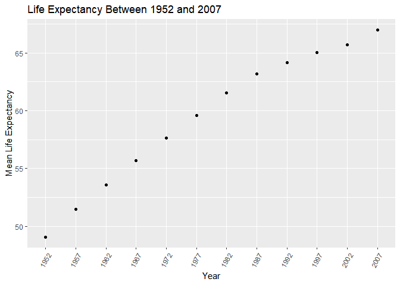
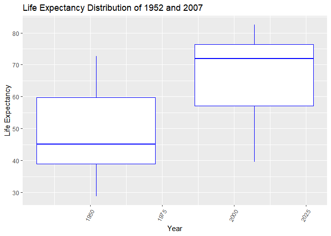
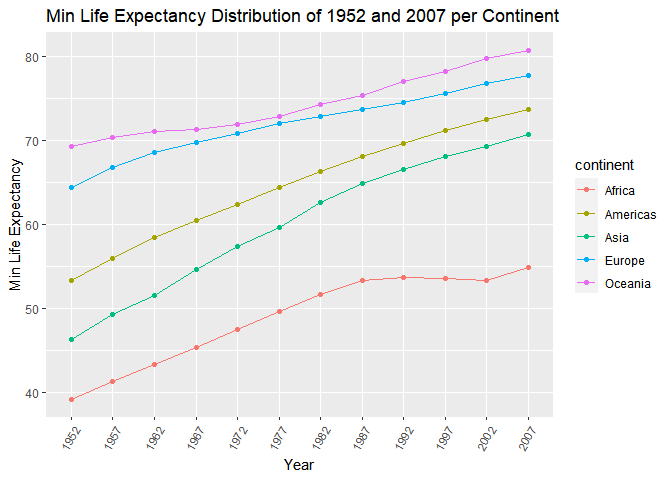
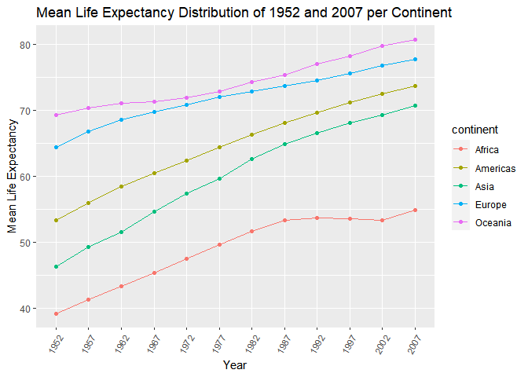
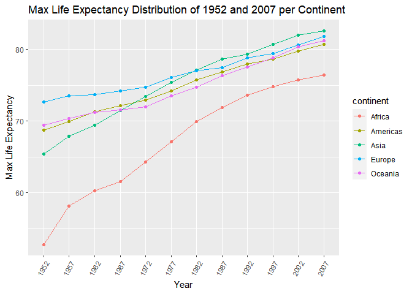
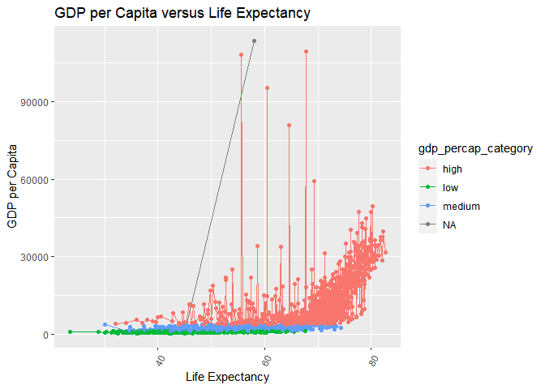
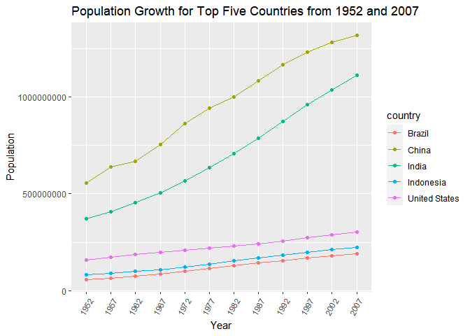
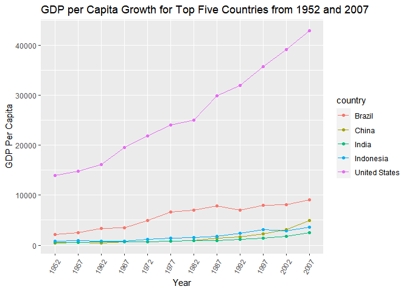
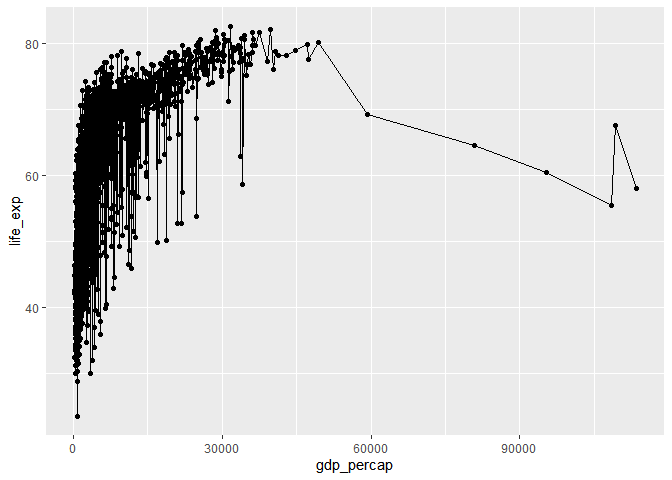
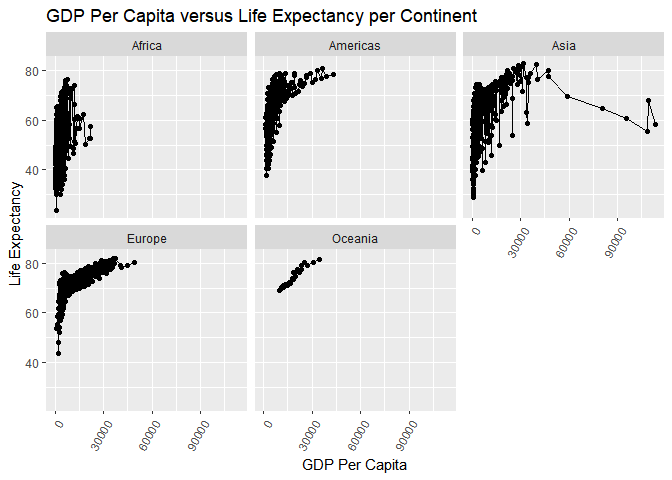

## Instructions
Answer the following questions and complete the exercises in RMarkdown. Please embed all of your code and push your final work to your repository. Your final lab report should be organized, clean, and run free from errors. Remember, you must remove the `#` for the included code chunks to run. Be sure to add your name to the author header above. For any included plots, make sure they are clearly labeled. You are free to use any plot type that you feel best communicates the results of your analysis.  

**In this homework, you should make use of the aesthetics you have learned. It's OK to be flashy!**

Make sure to use the formatting conventions of RMarkdown to make your report neat and clean!  

## Load the libraries

```r
library(tidyverse)
library(janitor)
library(here)
library(naniar)
```

```r
options(scipen=999)
```

## Resources
The idea for this assignment came from [Rebecca Barter's](http://www.rebeccabarter.com/blog/2017-11-17-ggplot2_tutorial/) ggplot tutorial so if you get stuck this is a good place to have a look.  

## Gapminder
For this assignment, we are going to use the dataset [gapminder](https://cran.r-project.org/web/packages/gapminder/index.html). Gapminder includes information about economics, population, and life expectancy from countries all over the world. You will need to install it before use. This is the same data that we will use for midterm 2 so this is good practice.

```r
#install.packages("gapminder")
library("gapminder")
```

## Questions
The questions below are open-ended and have many possible solutions. Your approach should, where appropriate, include numerical summaries and visuals. Be creative; assume you are building an analysis that you would ultimately present to an audience of stakeholders. Feel free to try out different `geoms` if they more clearly present your results.  

**1. Use the function(s) of your choice to get an idea of the overall structure of the data frame, including its dimensions, column names, variable classes, etc. As part of this, determine how NA's are treated in the data.**  

```r
gapminder<-gapminder%>%clean_names()
```


```r
glimpse(gapminder)
```

```
## Rows: 1,704
## Columns: 6
## $ country    <fct> "Afghanistan", "Afghanistan", "Afghanistan", "Afghanistan",~
## $ continent  <fct> Asia, Asia, Asia, Asia, Asia, Asia, Asia, Asia, Asia, Asia,~
## $ year       <int> 1952, 1957, 1962, 1967, 1972, 1977, 1982, 1987, 1992, 1997,~
## $ life_exp   <dbl> 28.801, 30.332, 31.997, 34.020, 36.088, 38.438, 39.854, 40.~
## $ pop        <int> 8425333, 9240934, 10267083, 11537966, 13079460, 14880372, 1~
## $ gdp_percap <dbl> 779.4453, 820.8530, 853.1007, 836.1971, 739.9811, 786.1134,~
```


```r
dim(gapminder)
```

```
## [1] 1704    6
```

```r
summary(gapminder)
```

```
##         country        continent        year         life_exp    
##  Afghanistan:  12   Africa  :624   Min.   :1952   Min.   :23.60  
##  Albania    :  12   Americas:300   1st Qu.:1966   1st Qu.:48.20  
##  Algeria    :  12   Asia    :396   Median :1980   Median :60.71  
##  Angola     :  12   Europe  :360   Mean   :1980   Mean   :59.47  
##  Argentina  :  12   Oceania : 24   3rd Qu.:1993   3rd Qu.:70.85  
##  Australia  :  12                  Max.   :2007   Max.   :82.60  
##  (Other)    :1632                                                
##       pop               gdp_percap      
##  Min.   :     60011   Min.   :   241.2  
##  1st Qu.:   2793664   1st Qu.:  1202.1  
##  Median :   7023596   Median :  3531.8  
##  Mean   :  29601212   Mean   :  7215.3  
##  3rd Qu.:  19585222   3rd Qu.:  9325.5  
##  Max.   :1318683096   Max.   :113523.1  
## 
```


```r
names(gapminder)
```

```
## [1] "country"    "continent"  "year"       "life_exp"   "pop"       
## [6] "gdp_percap"
```

```r
naniar::miss_var_summary(gapminder)
```

```
## # A tibble: 6 x 3
##   variable   n_miss pct_miss
##   <chr>       <int>    <dbl>
## 1 country         0        0
## 2 continent       0        0
## 3 year            0        0
## 4 life_exp        0        0
## 5 pop             0        0
## 6 gdp_percap      0        0
```


**2. Among the interesting variables in gapminder is life expectancy. How has global life expectancy changed between 1952 and 2007?**

When taking the mean, on average life expectancy increased between 1952 and 2007. 


```r
gapminder%>%
  group_by(year)%>%
  summarise(mean_life_exp=mean(life_exp))%>%
  arrange(year)%>%
  ggplot(aes(x=as.factor(year), y=mean_life_exp))+geom_point()+geom_smooth(method=lm, se=T)+theme(axis.text.x=element_text(angle=60, hjust=1))+labs(title="Life Expectancy Between 1952 and 2007", x="Year", y="Mean Life Expectancy")
```

```
## `geom_smooth()` using formula 'y ~ x'
```

<!-- -->


**3. How do the distributions of life expectancy compare for the years 1952 and 2007?**
Life expectancy is higher in 2007, than 1952. 

```r
gapminder%>%
  filter(year %in% c("1952", "2007"))%>%
 ggplot(aes(x=year, y=life_exp, group=year, ))+geom_boxplot(color="blue")+theme(axis.text.x=element_text(angle=60, hjust=1))+labs(title="Life Expectancy Distribution of 1952 and 2007", x="Year", y="Life Expectancy")
```

<!-- -->


```r
gapminder%>%
  select(year, life_exp)%>%
  filter(year %in% c("1952", "2007"))%>%
  group_by(year)%>%
  arrange(year)
```

```
## # A tibble: 284 x 2
## # Groups:   year [2]
##     year life_exp
##    <int>    <dbl>
##  1  1952     28.8
##  2  1952     55.2
##  3  1952     43.1
##  4  1952     30.0
##  5  1952     62.5
##  6  1952     69.1
##  7  1952     66.8
##  8  1952     50.9
##  9  1952     37.5
## 10  1952     68  
## # ... with 274 more rows
```

**4. Your answer above doesn't tell the whole story since life expectancy varies by region. Make a summary that shows the min, mean, and max life expectancy by continent for all years represented in the data.**

```r
summary_gapminder<-gapminder%>%
  select(continent, life_exp, year)%>%
  group_by(continent, year)%>%
  summarise(min_life_exp=(min(life_exp)), mean_life_exp=mean(life_exp),max_life_exp=(max(life_exp)))
```

```
## `summarise()` has grouped output by 'continent'. You can override using the `.groups` argument.
```

```r
summary_gapminder
```

```
## # A tibble: 60 x 5
## # Groups:   continent [5]
##    continent  year min_life_exp mean_life_exp max_life_exp
##    <fct>     <int>        <dbl>         <dbl>        <dbl>
##  1 Africa     1952         30            39.1         52.7
##  2 Africa     1957         31.6          41.3         58.1
##  3 Africa     1962         32.8          43.3         60.2
##  4 Africa     1967         34.1          45.3         61.6
##  5 Africa     1972         35.4          47.5         64.3
##  6 Africa     1977         36.8          49.6         67.1
##  7 Africa     1982         38.4          51.6         69.9
##  8 Africa     1987         39.9          53.3         71.9
##  9 Africa     1992         23.6          53.6         73.6
## 10 Africa     1997         36.1          53.6         74.8
## # ... with 50 more rows
```
_Min Life Exp_

```r
summary_gapminder%>%
ggplot(aes(x=as.factor(year), y=mean_life_exp, group=continent, color=continent))+geom_line()+geom_point()+theme(axis.text.x=element_text(angle=60, hjust=1))+labs(title="Min Life Expectancy Distribution of 1952 and 2007 per Continent", x="Year", y="Min Life Expectancy")
```

<!-- -->
_Mean Life Expectancy_

```r
summary_gapminder%>%
ggplot(aes(x=as.factor(year), y=mean_life_exp, group=continent, color=continent))+geom_line()+geom_point()+theme(axis.text.x=element_text(angle=60, hjust=1))+labs(title="Mean Life Expectancy Distribution of 1952 and 2007 per Continent", x="Year", y="Mean Life Expectancy")
```

<!-- -->
_Max Life Expectancy_

```r
summary_gapminder%>%
ggplot(aes(x=as.factor(year), y=max_life_exp, group=continent, color=continent))+geom_line()+geom_point()+theme(axis.text.x=element_text(angle=60, hjust=1))+labs(title="Max Life Expectancy Distribution of 1952 and 2007 per Continent", x="Year", y="Max Life Expectancy")
```

<!-- -->

**5. How has life expectancy changed between 1952-2007 for each continent?**
_Mean Life Expectancy_

Life expectancy has increased for all continents between 1952 and 2007. This is shown in the above plots (average, max, and min).


```r
summary_gapminder%>%
ggplot(aes(x=as.factor(year), y=mean_life_exp, group=continent, color=continent))+geom_line()+geom_point()+theme(axis.text.x=element_text(angle=60, hjust=1))+labs(title="Mean Life Expectancy Distribution of 1952 and 2007 per Continent", x="Year", y="Mean Life Expectancy")
```

<!-- -->

**6. We are interested in the relationship between per capita GDP and life expectancy; i.e. does having more money help you live longer?**

```r
library(gtools)
quartiles<-quantcut(gapminder$gdp_percap)
table(quartiles)
```

```
## quartiles
##       [241,1.2e+03]  (1.2e+03,3.53e+03] (3.53e+03,9.33e+03] (9.33e+03,1.14e+05] 
##                 426                 426                 426                 426
```


```r
gapminder<-gapminder%>%
  mutate(gdp_percap_category=case_when(gdp_percap>241.2 & gdp_percap<1202.1~"low", gdp_percap>=1202.1 & gdp_percap<3531.8~"medium",gdp_percap>=3531.8 & gdp_percap<113523.1~"high" ))
gapminder
```

```
## # A tibble: 1,704 x 7
##    country     continent  year life_exp      pop gdp_percap gdp_percap_category
##    <fct>       <fct>     <int>    <dbl>    <int>      <dbl> <chr>              
##  1 Afghanistan Asia       1952     28.8  8425333       779. low                
##  2 Afghanistan Asia       1957     30.3  9240934       821. low                
##  3 Afghanistan Asia       1962     32.0 10267083       853. low                
##  4 Afghanistan Asia       1967     34.0 11537966       836. low                
##  5 Afghanistan Asia       1972     36.1 13079460       740. low                
##  6 Afghanistan Asia       1977     38.4 14880372       786. low                
##  7 Afghanistan Asia       1982     39.9 12881816       978. low                
##  8 Afghanistan Asia       1987     40.8 13867957       852. low                
##  9 Afghanistan Asia       1992     41.7 16317921       649. low                
## 10 Afghanistan Asia       1997     41.8 22227415       635. low                
## # ... with 1,694 more rows
```

The higher the GDP per Capita, the higher the life expectancy. 


```r
gapminder%>%
  filter(!is.na(gdp_percap), !is.na(life_exp))%>%
  ggplot(aes(x=life_exp, y=gdp_percap, group=gdp_percap_category, color=gdp_percap_category))+geom_line()+geom_point()+theme(axis.text.x=element_text(angle=60, hjust=1))+labs(title="GDP per Capita versus Life Expectancy", x="Life Expectancy", y="GDP per Capita" )
```

<!-- -->


**7. Which countries have had the largest population growth since 1952?**
China, India, US. 

This was found identifying the max and min population for each year (based on the year), taking the difference to find population growth. 


```r
gapminder%>%
  select(country, year, pop)%>%
  group_by(country)%>%
  summarise(pop_growth=(max(pop)-min(pop)))%>%
  arrange(desc(pop_growth))
```

```
## # A tibble: 142 x 2
##    country       pop_growth
##    <fct>              <int>
##  1 China          762419569
##  2 India          738396331
##  3 United States  143586947
##  4 Indonesia      141495000
##  5 Brazil         133408087
##  6 Pakistan       127924057
##  7 Bangladesh     103561480
##  8 Nigeria        101912068
##  9 Mexico          78556574
## 10 Philippines     68638596
## # ... with 132 more rows
```


**8. Use your results from the question above to plot population growth for the top five countries since 1952.**

```r
gapminder%>%
  filter(country %in% c("China", "India", "United States", "Indonesia", "Brazil"))%>%
  ggplot(aes(x=as.factor(year), y=pop, group=country, color=country))+geom_point()+geom_line()+theme(axis.text.x=element_text(angle=60, hjust=1))+labs(title="Population Growth for Top Five Countries from 1952 and 2007", x="Year", y="Population")
```

<!-- -->


**9. How does per-capita GDP growth compare between these same five countries?**

```r
gapminder%>%
  filter(country %in% c("China", "India", "United States", "Indonesia", "Brazil"))%>%
  ggplot(aes(x=as.factor(year), y=gdp_percap, group=country, color=country))+geom_point()+geom_line()+theme(axis.text.x=element_text(angle=60, hjust=1))+labs(title="GDP per Capita Growth for Top Five Countries from 1952 and 2007", x="Year", y="GDP Per Capita")
```

<!-- -->


**10. Make one plot of your choice that uses faceting!**

```r
g1<-gapminder%>%
  ggplot(aes(x=gdp_percap, y=life_exp))+geom_point()+geom_line()
g1
```

<!-- -->


```r
g1+facet_wrap(~continent)+theme(axis.text.x=element_text(angle=60, hjust=1))+labs(title="GDP Per Capita versus Life Expectancy per Continent", x="GDP Per Capita", y="Life Expectancy")
```

<!-- -->

## Push your final code to GitHub!
Please be sure that you check the `keep md` file in the knit preferences. 
