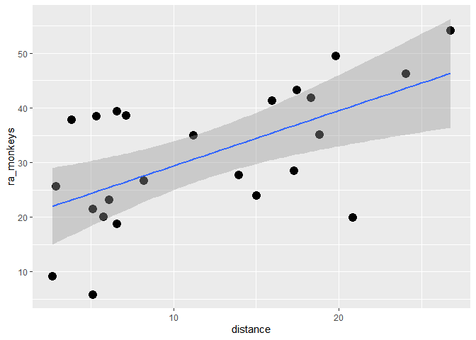

## Instructions
Answer the following questions and complete the exercises in RMarkdown. Please embed all of your code and push your final work to your repository. Your final lab report should be organized, clean, and run free from errors. Remember, you must remove the `#` for the included code chunks to run. Be sure to add your name to the author header above. For any included plots, make sure they are clearly labeled. You are free to use any plot type that you feel best communicates the results of your analysis.  

Make sure to use the formatting conventions of RMarkdown to make your report neat and clean!  

## Libraries

```r
library(tidyverse)
library(shiny)
library(shinydashboard)
library(janitor)
library(here)
library(naniar)
```

## Choose Your Adventure!
For this homework assignment, you have two choices of data. You only need to build an app for one of them. The first dataset is focused on UC Admissions and the second build on the Gabon data that we used for midterm 1.  

## Option 1
The data for this assignment come from the [University of California Information Center](https://www.universityofcalifornia.edu/infocenter). Admissions data were collected for the years 2010-2019 for each UC campus. Admissions are broken down into three categories: applications, admits, and enrollees. The number of individuals in each category are presented by demographic.  

**1. Load the `UC_admit.csv` data and use the function(s) of your choice to get an idea of the overall structure of the data frame, including its dimensions, column names, variable classes, etc. As part of this, determine if there are NA's and how they are treated.**  


**2. The president of UC has asked you to build a shiny app that shows admissions by ethnicity across all UC campuses. Your app should allow users to explore year, campus, and admit category as interactive variables. Use shiny dashboard and try to incorporate the aesthetics you have learned in ggplot to make the app neat and clean.**


**3. Make alternate version of your app above by tracking enrollment at a campus over all of the represented years while allowing users to interact with campus, category, and ethnicity.**  


## Option 2
We will use data from a study on vertebrate community composition and impacts from defaunation in Gabon, Africa. Reference: Koerner SE, Poulsen JR, Blanchard EJ, Okouyi J, Clark CJ. Vertebrate community composition and diversity declines along a defaunation gradient radiating from rural villages in Gabon. _Journal of Applied Ecology_. 2016.   

**1. Load the `IvindoData_DryadVersion.csv` data and use the function(s) of your choice to get an idea of the overall structure, including its dimensions, column names, variable classes, etc. As part of this, determine if NA's are present and how they are treated.**  

```r
gabon <- read_csv(here("lab13", "data", "IvindoData_DryadVersion.csv"))%>%clean_names()
```

```
## Rows: 24 Columns: 26
## -- Column specification --------------------------------------------------------
## Delimiter: ","
## chr  (2): HuntCat, LandUse
## dbl (24): TransectID, Distance, NumHouseholds, Veg_Rich, Veg_Stems, Veg_lian...
## 
## i Use `spec()` to retrieve the full column specification for this data.
## i Specify the column types or set `show_col_types = FALSE` to quiet this message.
```


```r
str(gabon)
```

```
## spec_tbl_df [24 x 26] (S3: spec_tbl_df/tbl_df/tbl/data.frame)
##  $ transect_id             : num [1:24] 1 2 2 3 4 5 6 7 8 9 ...
##  $ distance                : num [1:24] 7.14 17.31 18.32 20.85 15.95 ...
##  $ hunt_cat                : chr [1:24] "Moderate" "None" "None" "None" ...
##  $ num_households          : num [1:24] 54 54 29 29 29 29 29 54 25 73 ...
##  $ land_use                : chr [1:24] "Park" "Park" "Park" "Logging" ...
##  $ veg_rich                : num [1:24] 16.7 15.8 16.9 12.4 17.1 ...
##  $ veg_stems               : num [1:24] 31.2 37.4 32.3 29.4 36 ...
##  $ veg_liana               : num [1:24] 5.78 13.25 4.75 9.78 13.25 ...
##  $ veg_dbh                 : num [1:24] 49.6 34.6 42.8 36.6 41.5 ...
##  $ veg_canopy              : num [1:24] 3.78 3.75 3.43 3.75 3.88 2.5 4 4 3 3.25 ...
##  $ veg_understory          : num [1:24] 2.89 3.88 3 2.75 3.25 3 2.38 2.71 3.25 3.13 ...
##  $ ra_apes                 : num [1:24] 1.87 0 4.49 12.93 0 ...
##  $ ra_birds                : num [1:24] 52.7 52.2 37.4 59.3 52.6 ...
##  $ ra_elephant             : num [1:24] 0 0.86 1.33 0.56 1 0 1.11 0.43 2.2 0 ...
##  $ ra_monkeys              : num [1:24] 38.6 28.5 41.8 19.9 41.3 ...
##  $ ra_rodent               : num [1:24] 4.22 6.04 1.06 3.66 2.52 1.83 3.1 1.26 4.37 6.31 ...
##  $ ra_ungulate             : num [1:24] 2.66 12.41 13.86 3.71 2.53 ...
##  $ rich_all_species        : num [1:24] 22 20 22 19 20 22 23 19 19 19 ...
##  $ evenness_all_species    : num [1:24] 0.793 0.773 0.74 0.681 0.811 0.786 0.818 0.757 0.773 0.668 ...
##  $ diversity_all_species   : num [1:24] 2.45 2.31 2.29 2.01 2.43 ...
##  $ rich_bird_species       : num [1:24] 11 10 11 8 8 10 11 11 11 9 ...
##  $ evenness_bird_species   : num [1:24] 0.732 0.704 0.688 0.559 0.799 0.771 0.801 0.687 0.784 0.573 ...
##  $ diversity_bird_species  : num [1:24] 1.76 1.62 1.65 1.16 1.66 ...
##  $ rich_mammal_species     : num [1:24] 11 10 11 11 12 12 12 8 8 10 ...
##  $ evenness_mammal_species : num [1:24] 0.736 0.705 0.65 0.619 0.736 0.694 0.776 0.79 0.821 0.783 ...
##  $ diversity_mammal_species: num [1:24] 1.76 1.62 1.56 1.48 1.83 ...
##  - attr(*, "spec")=
##   .. cols(
##   ..   TransectID = col_double(),
##   ..   Distance = col_double(),
##   ..   HuntCat = col_character(),
##   ..   NumHouseholds = col_double(),
##   ..   LandUse = col_character(),
##   ..   Veg_Rich = col_double(),
##   ..   Veg_Stems = col_double(),
##   ..   Veg_liana = col_double(),
##   ..   Veg_DBH = col_double(),
##   ..   Veg_Canopy = col_double(),
##   ..   Veg_Understory = col_double(),
##   ..   RA_Apes = col_double(),
##   ..   RA_Birds = col_double(),
##   ..   RA_Elephant = col_double(),
##   ..   RA_Monkeys = col_double(),
##   ..   RA_Rodent = col_double(),
##   ..   RA_Ungulate = col_double(),
##   ..   Rich_AllSpecies = col_double(),
##   ..   Evenness_AllSpecies = col_double(),
##   ..   Diversity_AllSpecies = col_double(),
##   ..   Rich_BirdSpecies = col_double(),
##   ..   Evenness_BirdSpecies = col_double(),
##   ..   Diversity_BirdSpecies = col_double(),
##   ..   Rich_MammalSpecies = col_double(),
##   ..   Evenness_MammalSpecies = col_double(),
##   ..   Diversity_MammalSpecies = col_double()
##   .. )
##  - attr(*, "problems")=<externalptr>
```

```r
glimpse(gabon)
```

```
## Rows: 24
## Columns: 26
## $ transect_id              <dbl> 1, 2, 2, 3, 4, 5, 6, 7, 8, 9, 13, 14, 15, 16,~
## $ distance                 <dbl> 7.14, 17.31, 18.32, 20.85, 15.95, 17.47, 24.0~
## $ hunt_cat                 <chr> "Moderate", "None", "None", "None", "None", "~
## $ num_households           <dbl> 54, 54, 29, 29, 29, 29, 29, 54, 25, 73, 46, 5~
## $ land_use                 <chr> "Park", "Park", "Park", "Logging", "Park", "P~
## $ veg_rich                 <dbl> 16.67, 15.75, 16.88, 12.44, 17.13, 16.50, 14.~
## $ veg_stems                <dbl> 31.20, 37.44, 32.33, 29.39, 36.00, 29.22, 31.~
## $ veg_liana                <dbl> 5.78, 13.25, 4.75, 9.78, 13.25, 12.88, 8.38, ~
## $ veg_dbh                  <dbl> 49.57, 34.59, 42.82, 36.62, 41.52, 44.07, 51.~
## $ veg_canopy               <dbl> 3.78, 3.75, 3.43, 3.75, 3.88, 2.50, 4.00, 4.0~
## $ veg_understory           <dbl> 2.89, 3.88, 3.00, 2.75, 3.25, 3.00, 2.38, 2.7~
## $ ra_apes                  <dbl> 1.87, 0.00, 4.49, 12.93, 0.00, 2.48, 3.78, 6.~
## $ ra_birds                 <dbl> 52.66, 52.17, 37.44, 59.29, 52.62, 38.64, 42.~
## $ ra_elephant              <dbl> 0.00, 0.86, 1.33, 0.56, 1.00, 0.00, 1.11, 0.4~
## $ ra_monkeys               <dbl> 38.59, 28.53, 41.82, 19.85, 41.34, 43.29, 46.~
## $ ra_rodent                <dbl> 4.22, 6.04, 1.06, 3.66, 2.52, 1.83, 3.10, 1.2~
## $ ra_ungulate              <dbl> 2.66, 12.41, 13.86, 3.71, 2.53, 13.75, 3.10, ~
## $ rich_all_species         <dbl> 22, 20, 22, 19, 20, 22, 23, 19, 19, 19, 21, 2~
## $ evenness_all_species     <dbl> 0.793, 0.773, 0.740, 0.681, 0.811, 0.786, 0.8~
## $ diversity_all_species    <dbl> 2.452, 2.314, 2.288, 2.006, 2.431, 2.429, 2.5~
## $ rich_bird_species        <dbl> 11, 10, 11, 8, 8, 10, 11, 11, 11, 9, 11, 11, ~
## $ evenness_bird_species    <dbl> 0.732, 0.704, 0.688, 0.559, 0.799, 0.771, 0.8~
## $ diversity_bird_species   <dbl> 1.756, 1.620, 1.649, 1.162, 1.660, 1.775, 1.9~
## $ rich_mammal_species      <dbl> 11, 10, 11, 11, 12, 12, 12, 8, 8, 10, 10, 11,~
## $ evenness_mammal_species  <dbl> 0.736, 0.705, 0.650, 0.619, 0.736, 0.694, 0.7~
## $ diversity_mammal_species <dbl> 1.764, 1.624, 1.558, 1.484, 1.829, 1.725, 1.9~
```


```r
names(gabon)
```

```
##  [1] "transect_id"              "distance"                
##  [3] "hunt_cat"                 "num_households"          
##  [5] "land_use"                 "veg_rich"                
##  [7] "veg_stems"                "veg_liana"               
##  [9] "veg_dbh"                  "veg_canopy"              
## [11] "veg_understory"           "ra_apes"                 
## [13] "ra_birds"                 "ra_elephant"             
## [15] "ra_monkeys"               "ra_rodent"               
## [17] "ra_ungulate"              "rich_all_species"        
## [19] "evenness_all_species"     "diversity_all_species"   
## [21] "rich_bird_species"        "evenness_bird_species"   
## [23] "diversity_bird_species"   "rich_mammal_species"     
## [25] "evenness_mammal_species"  "diversity_mammal_species"
```


```r
naniar::miss_var_summary(gabon)
```

```
## # A tibble: 26 x 3
##    variable       n_miss pct_miss
##    <chr>           <int>    <dbl>
##  1 transect_id         0        0
##  2 distance            0        0
##  3 hunt_cat            0        0
##  4 num_households      0        0
##  5 land_use            0        0
##  6 veg_rich            0        0
##  7 veg_stems           0        0
##  8 veg_liana           0        0
##  9 veg_dbh             0        0
## 10 veg_canopy          0        0
## # ... with 16 more rows
```
**Proof of concept for what type of plot to make. 

```r
gabon%>%
  ggplot(aes(x=distance, y=ra_monkeys))+geom_point(size=4)+geom_smooth(method="lm")
```

```
## `geom_smooth()` using formula 'y ~ x'
```

<!-- -->

**2. Build an app that re-creates the plots shown on page 810 of this paper. The paper is included in the folder. It compares the relative abundance % to the distance from villages in rural Gabon. Use shiny dashboard and add aesthetics to the plot.  **  


```r
ui <- dashboardPage(
  dashboardHeader(title = "Relative Abundance of Taxonomic Guilds with Distance from Nearest Village in the Invindo Landscape"),
  dashboardSidebar(disable = T),
  dashboardBody(
  fluidRow(
  box(title = "Plot Options", width = 3,
  selectInput("x", "Select RA Taxon", choices = c("ra_apes", "ra_birds", "ra_elephant", "ra_monkeys", "ra_rodent", "ra_ungulate"), 
              selected = "ra_apes"),
      hr(),
      helpText("Reference: Koerner SE, Poulsen JR, Blanchard EJ, Okouyi J, Clark CJ. Vertebrate community composition and diversity declines along a defaunation gradient radiating from rural villages in Gabon. Journal of Applied Ecology. 2016.")
  ), # close the first box
  box(title = "Relative Abundance % Per Taxon", width = 6,
  plotOutput("plot", width = "600px", height = "600px")
  ) # close the second box
  ) # close the row
  ) # close the dashboard body
) # close the ui
server <- function(input, output, session) { 
  
  output$plot <- renderPlot({
  gabon %>% 
  ggplot(aes_string(x = "distance", y = input$x)) +
  geom_point(size=4)+
  geom_smooth(method=lm, se=T)+
  scale_x_continuous(breaks=seq(0, 30, by = 5))+ theme_light(base_size = 18)
  })
  
  # stop the app when we close it
  session$onSessionEnded(stopApp)
  }
shinyApp(ui, server)
```

`<div style="width: 100% ; height: 400px ; text-align: center; box-sizing: border-box; -moz-box-sizing: border-box; -webkit-box-sizing: border-box;" class="muted well">Shiny applications not supported in static R Markdown documents</div>`{=html}


## Push your final code to GitHub!
Please be sure that you check the `keep md` file in the knit preferences. 
