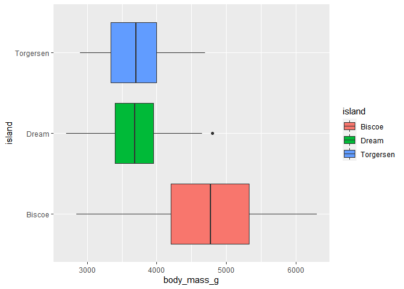
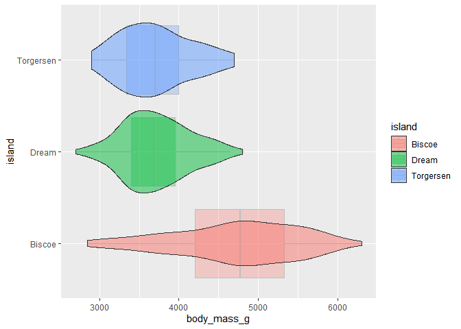
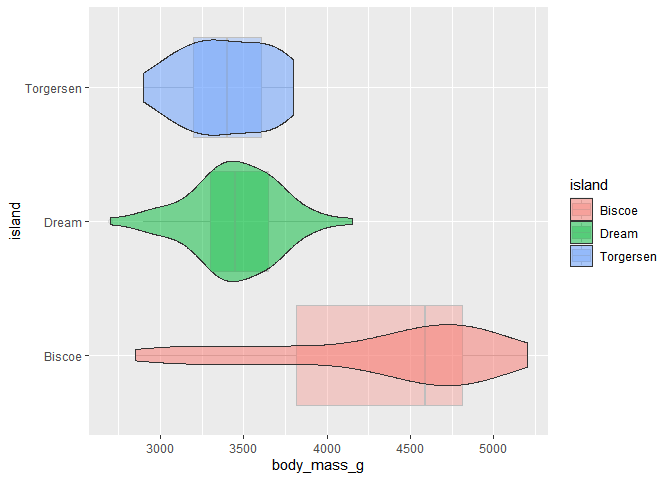
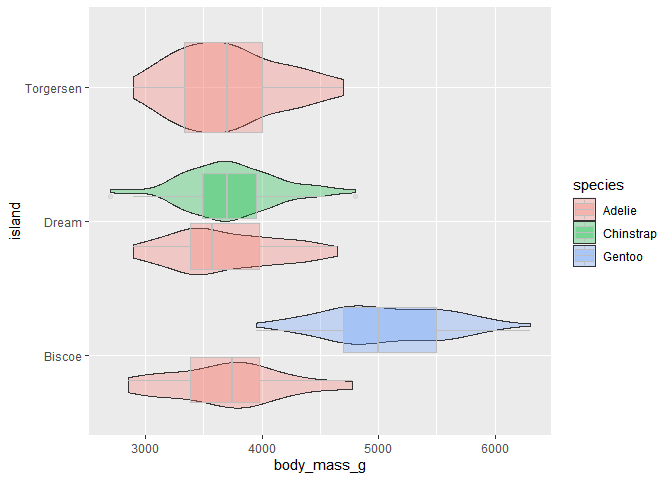
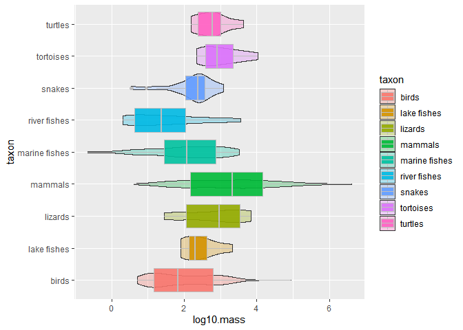
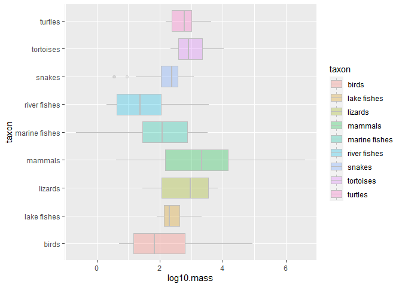
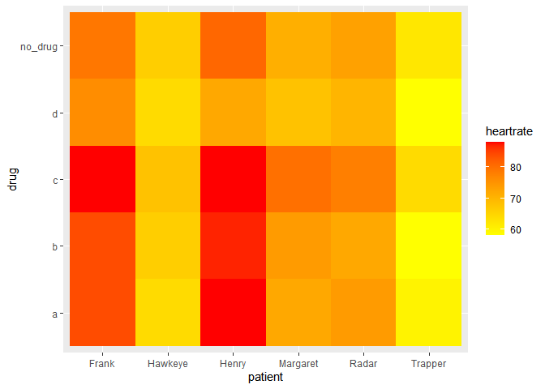
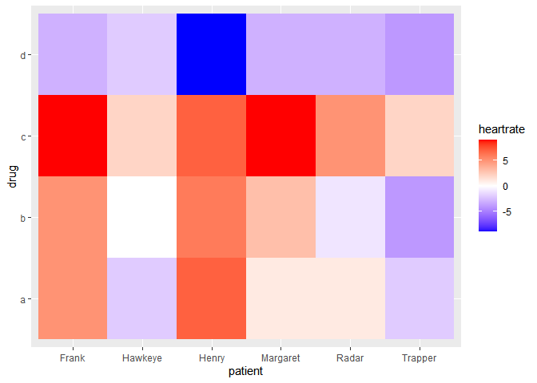
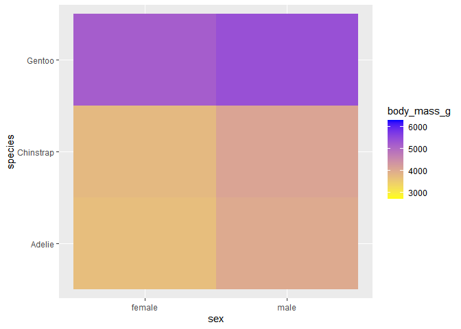

## Learning Goals
*At the end of this exercise, you will be able to:*    
1. Build a violin plot with `geom_violin`.
2. Build heat maps using `geom_tile`.


## Load the Libraries

```r
library(tidyverse)
```

```
## -- Attaching packages --------------------------------------- tidyverse 1.3.1 --
```

```
## v ggplot2 3.3.5     v purrr   0.3.4
## v tibble  3.1.6     v dplyr   1.0.8
## v tidyr   1.2.0     v stringr 1.4.0
## v readr   2.1.2     v forcats 0.5.1
```

```
## -- Conflicts ------------------------------------------ tidyverse_conflicts() --
## x dplyr::filter() masks stats::filter()
## x dplyr::lag()    masks stats::lag()
```

```r
library(janitor)
```

```
## 
## Attaching package: 'janitor'
```

```
## The following objects are masked from 'package:stats':
## 
##     chisq.test, fisher.test
```

```r
library("palmerpenguins")

options(scipen=999) #cancels the use of scientific notation for the session
```

## Load The Data

We will be using the `palmer penguins` data for checking out violin plots.
We will use a slightly modified version of the `heartrate` data for trying out heat maps.

We will use the homerange data for practice. I've made some modifications that will be important for part 2 of the lab, so we will load it all in now.

```r
penguins <- penguins

heartrate <- readr::read_csv("data/heartrate.csv")
```

```
## Rows: 6 Columns: 5
## -- Column specification --------------------------------------------------------
## Delimiter: ","
## chr (1): patient
## dbl (4): a, b, c, d
## 
## i Use `spec()` to retrieve the full column specification for this data.
## i Specify the column types or set `show_col_types = FALSE` to quiet this message.
```

```r
heartrate <- heartrate %>%
  add_column(no_drug = c(71, 79, 66, 62, 73, 81) )


homerange <- read_csv("data/modified_Tamburelloetal_HomeRangeDatabase.csv")
```

```
## Rows: 570 Columns: 24
## -- Column specification --------------------------------------------------------
## Delimiter: ","
## chr (16): taxon, common.name, class, order, family, genus, species, primarym...
## dbl  (8): mean.mass.g, log10.mass, mean.hra.m2, log10.hra, dimension, preyma...
## 
## i Use `spec()` to retrieve the full column specification for this data.
## i Specify the column types or set `show_col_types = FALSE` to quiet this message.
```

## Violin Plots

  Violin plots are relatively common in scientific publications. They show 
the distribution of continuous data across a categorical variable.

  Violin plots are sometimes chosen as an alternative to box plots, especially if you expect the data to have a [non-normal distribution](https://en.wikipedia.org/wiki/Normal_distribution) (i.e. not a bell curve). They are very similar to density plots 
  
  They are great for looking at the range & spread of data, while roughly comparing averages across categorical variables.


```r
head(penguins)
```

```
## # A tibble: 6 x 8
##   species island bill_length_mm bill_depth_mm flipper_length_~ body_mass_g sex  
##   <fct>   <fct>           <dbl>         <dbl>            <int>       <int> <fct>
## 1 Adelie  Torge~           39.1          18.7              181        3750 male 
## 2 Adelie  Torge~           39.5          17.4              186        3800 fema~
## 3 Adelie  Torge~           40.3          18                195        3250 fema~
## 4 Adelie  Torge~           NA            NA                 NA          NA <NA> 
## 5 Adelie  Torge~           36.7          19.3              193        3450 fema~
## 6 Adelie  Torge~           39.3          20.6              190        3650 male 
## # ... with 1 more variable: year <int>
```


**Let's say we want to travel to an island and take pictures of the cutest little penguines we can find. We need to determine which island we are most likely to find the smallest penguins on.**

We can use a boxplot look at how penguin mass changes by island:

```r
penguins %>% 
  ggplot(aes(x = island, y = body_mass_g, fill = island)) +
  geom_boxplot(na.rm = TRUE)+
  coord_flip()
```

<!-- -->

It looks like pretty much a tie between Torgersen and Dream islands, but sometimes we miss information about the spread of data with box plots. 

Lets try a Violin plot! We can even layer it over the box plot to compare.

```r
penguins %>% 
  ggplot(aes(x = island, y = body_mass_g, fill = island)) +
  geom_boxplot(color = "grey", alpha = .3, na.rm = TRUE) +
  geom_violin(alpha = .5, na.rm = TRUE) +
  coord_flip()
```

<!-- -->

It looks like there is kind of a non-normal shape in at least 2 islands- 
this could be a difference in sex, so lets examine only females:

```r
penguins %>% 
  filter(sex == "female") %>% 
  ggplot(aes(x = island, y = body_mass_g, fill = island)) +
  geom_boxplot(color = "grey", alpha = .3, na.rm = TRUE) +
  geom_violin(alpha = .5, na.rm = TRUE) +
  coord_flip()
```

<!-- -->
Well that didnt really reveal the reason for the bimodal shape on Biscoe. 
Let's try filling by species.

```r
penguins %>% 
  ggplot(aes(x = island, y = body_mass_g, fill = species)) +
  geom_violin(alpha = .3, na.rm = TRUE) +
  geom_boxplot(color = "grey", alpha = .3, na.rm = TRUE) +
  coord_flip()
```

<!-- -->


Cool! Now we see that there are actually some of the smallest penguins on Biscoe island. 

## Practice

Try making a violin plot of taxon from the homerange data:
 1. Remind yourself what the data look like:


```r
str(homerange)
```

```
## spec_tbl_df [570 x 24] (S3: spec_tbl_df/tbl_df/tbl/data.frame)
##  $ taxon                     : chr [1:570] "lake fishes" "river fishes" "river fishes" "river fishes" ...
##  $ common.name               : chr [1:570] "american eel" "blacktail redhorse" "central stoneroller" "rosyside dace" ...
##  $ class                     : chr [1:570] "actinopterygii" "actinopterygii" "actinopterygii" "actinopterygii" ...
##  $ order                     : chr [1:570] "anguilliformes" "cypriniformes" "cypriniformes" "cypriniformes" ...
##  $ family                    : chr [1:570] "anguillidae" "catostomidae" "cyprinidae" "cyprinidae" ...
##  $ genus                     : chr [1:570] "anguilla" "moxostoma" "campostoma" "clinostomus" ...
##  $ species                   : chr [1:570] "rostrata" "poecilura" "anomalum" "funduloides" ...
##  $ primarymethod             : chr [1:570] "telemetry" "mark-recapture" "mark-recapture" "mark-recapture" ...
##  $ N                         : chr [1:570] "16" NA "20" "26" ...
##  $ mean.mass.g               : num [1:570] 887 562 34 4 4 ...
##  $ log10.mass                : num [1:570] 2.948 2.75 1.531 0.602 0.602 ...
##  $ alternative.mass.reference: chr [1:570] NA NA NA NA ...
##  $ mean.hra.m2               : num [1:570] 282750 282.1 116.1 125.5 87.1 ...
##  $ log10.hra                 : num [1:570] 5.45 2.45 2.06 2.1 1.94 ...
##  $ hra.reference             : chr [1:570] "Minns, C. K. 1995. Allometry of home range size in lake and river fishes. Canadian Journal of Fisheries and Aqu"| __truncated__ "Minns, C. K. 1995. Allometry of home range size in lake and river fishes. Canadian Journal of Fisheries and Aqu"| __truncated__ "Minns, C. K. 1995. Allometry of home range size in lake and river fishes. Canadian Journal of Fisheries and Aqu"| __truncated__ "Minns, C. K. 1995. Allometry of home range size in lake and river fishes. Canadian Journal of Fisheries and Aqu"| __truncated__ ...
##  $ realm                     : chr [1:570] "aquatic" "aquatic" "aquatic" "aquatic" ...
##  $ thermoregulation          : chr [1:570] "ectotherm" "ectotherm" "ectotherm" "ectotherm" ...
##  $ locomotion                : chr [1:570] "swimming" "swimming" "swimming" "swimming" ...
##  $ trophic.guild             : chr [1:570] "carnivore" "carnivore" "carnivore" "carnivore" ...
##  $ dimension                 : num [1:570] 3 2 2 2 2 2 2 2 2 2 ...
##  $ preymass                  : num [1:570] NA NA NA NA NA NA 1.39 NA NA NA ...
##  $ log10.preymass            : num [1:570] NA NA NA NA NA ...
##  $ PPMR                      : num [1:570] NA NA NA NA NA NA 530 NA NA NA ...
##  $ prey.size.reference       : chr [1:570] NA NA NA NA ...
##  - attr(*, "spec")=
##   .. cols(
##   ..   taxon = col_character(),
##   ..   common.name = col_character(),
##   ..   class = col_character(),
##   ..   order = col_character(),
##   ..   family = col_character(),
##   ..   genus = col_character(),
##   ..   species = col_character(),
##   ..   primarymethod = col_character(),
##   ..   N = col_character(),
##   ..   mean.mass.g = col_double(),
##   ..   log10.mass = col_double(),
##   ..   alternative.mass.reference = col_character(),
##   ..   mean.hra.m2 = col_double(),
##   ..   log10.hra = col_double(),
##   ..   hra.reference = col_character(),
##   ..   realm = col_character(),
##   ..   thermoregulation = col_character(),
##   ..   locomotion = col_character(),
##   ..   trophic.guild = col_character(),
##   ..   dimension = col_double(),
##   ..   preymass = col_double(),
##   ..   log10.preymass = col_double(),
##   ..   PPMR = col_double(),
##   ..   prey.size.reference = col_character()
##   .. )
##  - attr(*, "problems")=<externalptr>
```

```r
summary(homerange)
```

```
##     taxon           common.name           class              order          
##  Length:570         Length:570         Length:570         Length:570        
##  Class :character   Class :character   Class :character   Class :character  
##  Mode  :character   Mode  :character   Mode  :character   Mode  :character  
##                                                                             
##                                                                             
##                                                                             
##                                                                             
##     family             genus             species          primarymethod     
##  Length:570         Length:570         Length:570         Length:570        
##  Class :character   Class :character   Class :character   Class :character  
##  Mode  :character   Mode  :character   Mode  :character   Mode  :character  
##                                                                             
##                                                                             
##                                                                             
##                                                                             
##       N              mean.mass.g        log10.mass     
##  Length:570         Min.   :      0   Min.   :-0.6576  
##  Class :character   1st Qu.:     50   1st Qu.: 1.6964  
##  Mode  :character   Median :    329   Median : 2.5169  
##                     Mean   :  34541   Mean   : 2.5915  
##                     3rd Qu.:   2144   3rd Qu.: 3.3312  
##                     Max.   :4000000   Max.   : 6.6021  
##                                                        
##  alternative.mass.reference  mean.hra.m2           log10.hra     
##  Length:570                 Min.   :         0   Min.   :-1.523  
##  Class :character           1st Qu.:      4500   1st Qu.: 3.653  
##  Mode  :character           Median :     39344   Median : 4.595  
##                             Mean   :  21456509   Mean   : 4.709  
##                             3rd Qu.:   1038100   3rd Qu.: 6.016  
##                             Max.   :3550830977   Max.   : 9.550  
##                             NA's   :1            NA's   :1       
##  hra.reference         realm           thermoregulation    locomotion       
##  Length:570         Length:570         Length:570         Length:570        
##  Class :character   Class :character   Class :character   Class :character  
##  Mode  :character   Mode  :character   Mode  :character   Mode  :character  
##                                                                             
##                                                                             
##                                                                             
##                                                                             
##  trophic.guild        dimension        preymass         log10.preymass   
##  Length:570         Min.   :2.000   Min.   :     0.67   Min.   :-0.1739  
##  Class :character   1st Qu.:2.000   1st Qu.:    20.02   1st Qu.: 1.3014  
##  Mode  :character   Median :2.000   Median :    53.75   Median : 1.7304  
##                     Mean   :2.218   Mean   :  3989.88   Mean   : 2.0188  
##                     3rd Qu.:2.000   3rd Qu.:   363.35   3rd Qu.: 2.5603  
##                     Max.   :3.000   Max.   :130233.20   Max.   : 5.1147  
##                     NA's   :1       NA's   :503         NA's   :503      
##       PPMR         prey.size.reference
##  Min.   :  0.380   Length:570         
##  1st Qu.:  3.315   Class :character   
##  Median :  7.190   Mode  :character   
##  Mean   : 31.752                      
##  3rd Qu.: 15.966                      
##  Max.   :530.000                      
##  NA's   :503
```

```r
names(homerange)
```

```
##  [1] "taxon"                      "common.name"               
##  [3] "class"                      "order"                     
##  [5] "family"                     "genus"                     
##  [7] "species"                    "primarymethod"             
##  [9] "N"                          "mean.mass.g"               
## [11] "log10.mass"                 "alternative.mass.reference"
## [13] "mean.hra.m2"                "log10.hra"                 
## [15] "hra.reference"              "realm"                     
## [17] "thermoregulation"           "locomotion"                
## [19] "trophic.guild"              "dimension"                 
## [21] "preymass"                   "log10.preymass"            
## [23] "PPMR"                       "prey.size.reference"
```

  2. Make a violin plot of `log10.mass` by `taxon`, and a box plot of `log10.mass` by `taxon`. You can use 1 or 2 plots.

```r
homerange %>% 
  ggplot(aes(x = log10.mass, y = taxon, fill = taxon)) +
  geom_violin(alpha = .3, na.rm = TRUE) +
  geom_boxplot(color = "grey", alpha = .9, na.rm = TRUE) 
```

<!-- -->

```r
homerange %>% 
  ggplot(aes(x = log10.mass, y = taxon, fill = taxon)) +
  geom_boxplot(color = "grey", alpha = .3, na.rm = TRUE) 
```

<!-- -->

3. What information can you gather from the violin plot that might have been missed with the box plot?
We can see that there is a greater distribution of birds. 

## Heat maps

Heat maps are cool for a lot of things, but they are particularly good for showing effect size, or magnitude of change.

Let's check out the `heartrate` data, which show results from a drug trial with four treatments on six patients. The `none` column represents heart rate with no drug, and it will act as a control.  

```r
heartrate
```

```
## # A tibble: 6 x 6
##   patient      a     b     c     d no_drug
##   <chr>    <dbl> <dbl> <dbl> <dbl>   <dbl>
## 1 Margaret    72    74    80    68      71
## 2 Frank       84    84    88    76      79
## 3 Hawkeye     64    66    68    64      66
## 4 Trapper     60    58    64    58      62
## 5 Radar       74    72    78    70      73
## 6 Henry       88    87    88    72      81
```

Let's pivot this data, so there is no data stored in variables, then we can use `geom_tile()` to represent the values (heartrate) by patient and treatment. 

```r
heartrate_long <- heartrate %>% 
  pivot_longer(-patient, #patient does not pivot
               names_to = "drug", 
               values_to = "heartrate"
               )
heartrate_long
```

```
## # A tibble: 30 x 3
##    patient  drug    heartrate
##    <chr>    <chr>       <dbl>
##  1 Margaret a              72
##  2 Margaret b              74
##  3 Margaret c              80
##  4 Margaret d              68
##  5 Margaret no_drug        71
##  6 Frank    a              84
##  7 Frank    b              84
##  8 Frank    c              88
##  9 Frank    d              76
## 10 Frank    no_drug        79
## # ... with 20 more rows
```


```r
heartrate_long %>%
  ggplot(aes(patient, drug, fill= heartrate)) + 
  geom_tile() +
  scale_fill_gradient(low="yellow", high="red")
```

<!-- -->

Now, let's instead look at how each drug changed the heartrate from the normal, using mutate

```r
heartrate_diff <- heartrate%>%
  mutate(across(c(a,b,c,d), ~ . - no_drug)) %>% 
  select(-no_drug) %>% 
    pivot_longer(-patient, #patient does not pivot
               names_to = "drug", 
               values_to = "heartrate"
               ) 
heartrate_diff
```

```
## # A tibble: 24 x 3
##    patient  drug  heartrate
##    <chr>    <chr>     <dbl>
##  1 Margaret a             1
##  2 Margaret b             3
##  3 Margaret c             9
##  4 Margaret d            -3
##  5 Frank    a             5
##  6 Frank    b             5
##  7 Frank    c             9
##  8 Frank    d            -3
##  9 Hawkeye  a            -2
## 10 Hawkeye  b             0
## # ... with 14 more rows
```


```r
heartrate_diff %>% 
  ggplot(aes(patient, drug, fill= heartrate)) + 
  geom_tile()+
  scale_fill_gradient2(low="blue", mid = "white", high="red")
```

<!-- -->

```r
# scale_fill_graient2 lets you set a color direction for zero (mid), positive (high), and negative (low)
```


## Practice
  1. Which drug lowers heart rate? raises it?
  Drug D lowers heart rate. Drug C raises heart rate. 

  

  2. Make a heat map for body mass by species & sex for penguins


```r
penguins%>%
  filter(!sex=="NA")%>%
  ggplot(aes(sex, species,  fill= body_mass_g)) + 
  geom_tile()+
  scale_fill_gradient(low="yellow", high="blue")
```

<!-- -->


## That's it! Take a break and I will see you for part 2!  

-->[Home](https://jmledford3115.github.io/datascibiol/)


