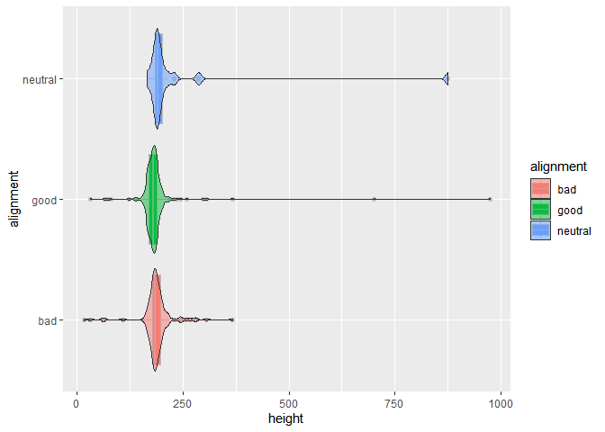

### Load the Libraries

```r
library(tidyverse)
```

```
## -- Attaching packages --------------------------------------- tidyverse 1.3.1 --
```

```
## v ggplot2 3.3.5     v purrr   0.3.4
## v tibble  3.1.6     v dplyr   1.0.8
## v tidyr   1.2.0     v stringr 1.4.0
## v readr   2.1.2     v forcats 0.5.1
```

```
## -- Conflicts ------------------------------------------ tidyverse_conflicts() --
## x dplyr::filter() masks stats::filter()
## x dplyr::lag()    masks stats::lag()
```

```r
library(janitor)
```

```
## 
## Attaching package: 'janitor'
```

```
## The following objects are masked from 'package:stats':
## 
##     chisq.test, fisher.test
```

```r
library("palmerpenguins")

#install.packages("ggVennDiagram")
library(ggVennDiagram)
library(RColorBrewer)

#install.packages("ggworldcloud")
library(ggwordcloud)


options(scipen=999) #cancels the use of scientific notation for the session
```


### Data

```r
superhero_info <- readr::read_csv("data/heroes_information.csv", na = c("", "-99", "-"))
```

```
## Rows: 734 Columns: 10
## -- Column specification --------------------------------------------------------
## Delimiter: ","
## chr (8): name, Gender, Eye color, Race, Hair color, Publisher, Skin color, A...
## dbl (2): Height, Weight
## 
## i Use `spec()` to retrieve the full column specification for this data.
## i Specify the column types or set `show_col_types = FALSE` to quiet this message.
```

```r
superhero_powers <- readr::read_csv("data/super_hero_powers.csv", na = c("", "-99", "-"))
```

```
## Rows: 667 Columns: 168
## -- Column specification --------------------------------------------------------
## Delimiter: ","
## chr   (1): hero_names
## lgl (167): Agility, Accelerated Healing, Lantern Power Ring, Dimensional Awa...
## 
## i Use `spec()` to retrieve the full column specification for this data.
## i Specify the column types or set `show_col_types = FALSE` to quiet this message.
```

```r
beachbugs_long <- readr::read_csv("data/beachbugs_long.csv")
```

```
## Rows: 66 Columns: 3
## -- Column specification --------------------------------------------------------
## Delimiter: ","
## chr (1): site
## dbl (2): year, buglevels
## 
## i Use `spec()` to retrieve the full column specification for this data.
## i Specify the column types or set `show_col_types = FALSE` to quiet this message.
```

### 1. 
Clean up the column names (no capitals, not spaces) of `superhero_info`, then use 2 functions to remind yourself of structure of the `superhero_info` data set.


```r
superhero_info <- readr::read_csv("data/heroes_information.csv", na = c("", "-99", "-"))%>%clean_names()
```

```
## Rows: 734 Columns: 10
## -- Column specification --------------------------------------------------------
## Delimiter: ","
## chr (8): name, Gender, Eye color, Race, Hair color, Publisher, Skin color, A...
## dbl (2): Height, Weight
## 
## i Use `spec()` to retrieve the full column specification for this data.
## i Specify the column types or set `show_col_types = FALSE` to quiet this message.
```

```r
superhero_powers <- readr::read_csv("data/super_hero_powers.csv", na = c("", "-99", "-"))%>%clean_names()
```

```
## Rows: 667 Columns: 168
## -- Column specification --------------------------------------------------------
## Delimiter: ","
## chr   (1): hero_names
## lgl (167): Agility, Accelerated Healing, Lantern Power Ring, Dimensional Awa...
## 
## i Use `spec()` to retrieve the full column specification for this data.
## i Specify the column types or set `show_col_types = FALSE` to quiet this message.
```

```r
beachbugs_long <- readr::read_csv("data/beachbugs_long.csv")%>%clean_names()
```

```
## Rows: 66 Columns: 3
## -- Column specification --------------------------------------------------------
## Delimiter: ","
## chr (1): site
## dbl (2): year, buglevels
## 
## i Use `spec()` to retrieve the full column specification for this data.
## i Specify the column types or set `show_col_types = FALSE` to quiet this message.
```

```r
str(superhero_info)
```

```
## spec_tbl_df [734 x 10] (S3: spec_tbl_df/tbl_df/tbl/data.frame)
##  $ name      : chr [1:734] "A-Bomb" "Abe Sapien" "Abin Sur" "Abomination" ...
##  $ gender    : chr [1:734] "Male" "Male" "Male" "Male" ...
##  $ eye_color : chr [1:734] "yellow" "blue" "blue" "green" ...
##  $ race      : chr [1:734] "Human" "Icthyo Sapien" "Ungaran" "Human / Radiation" ...
##  $ hair_color: chr [1:734] "No Hair" "No Hair" "No Hair" "No Hair" ...
##  $ height    : num [1:734] 203 191 185 203 NA 193 NA 185 173 178 ...
##  $ publisher : chr [1:734] "Marvel Comics" "Dark Horse Comics" "DC Comics" "Marvel Comics" ...
##  $ skin_color: chr [1:734] NA "blue" "red" NA ...
##  $ alignment : chr [1:734] "good" "good" "good" "bad" ...
##  $ weight    : num [1:734] 441 65 90 441 NA 122 NA 88 61 81 ...
##  - attr(*, "spec")=
##   .. cols(
##   ..   name = col_character(),
##   ..   Gender = col_character(),
##   ..   `Eye color` = col_character(),
##   ..   Race = col_character(),
##   ..   `Hair color` = col_character(),
##   ..   Height = col_double(),
##   ..   Publisher = col_character(),
##   ..   `Skin color` = col_character(),
##   ..   Alignment = col_character(),
##   ..   Weight = col_double()
##   .. )
##  - attr(*, "problems")=<externalptr>
```

```r
glimpse(superhero_info)
```

```
## Rows: 734
## Columns: 10
## $ name       <chr> "A-Bomb", "Abe Sapien", "Abin Sur", "Abomination", "Abraxas~
## $ gender     <chr> "Male", "Male", "Male", "Male", "Male", "Male", "Male", "Ma~
## $ eye_color  <chr> "yellow", "blue", "blue", "green", "blue", "blue", "blue", ~
## $ race       <chr> "Human", "Icthyo Sapien", "Ungaran", "Human / Radiation", "~
## $ hair_color <chr> "No Hair", "No Hair", "No Hair", "No Hair", "Black", "No Ha~
## $ height     <dbl> 203, 191, 185, 203, NA, 193, NA, 185, 173, 178, 191, 188, 1~
## $ publisher  <chr> "Marvel Comics", "Dark Horse Comics", "DC Comics", "Marvel ~
## $ skin_color <chr> NA, "blue", "red", NA, NA, NA, NA, NA, NA, NA, NA, NA, NA, ~
## $ alignment  <chr> "good", "good", "good", "bad", "bad", "bad", "good", "good"~
## $ weight     <dbl> 441, 65, 90, 441, NA, 122, NA, 88, 61, 81, 104, 108, 90, 90~
```


```r
str(superhero_powers)
```

```
## spec_tbl_df [667 x 168] (S3: spec_tbl_df/tbl_df/tbl/data.frame)
##  $ hero_names                  : chr [1:667] "3-D Man" "A-Bomb" "Abe Sapien" "Abin Sur" ...
##  $ agility                     : logi [1:667] TRUE FALSE TRUE FALSE FALSE FALSE ...
##  $ accelerated_healing         : logi [1:667] FALSE TRUE TRUE FALSE TRUE FALSE ...
##  $ lantern_power_ring          : logi [1:667] FALSE FALSE FALSE TRUE FALSE FALSE ...
##  $ dimensional_awareness       : logi [1:667] FALSE FALSE FALSE FALSE FALSE TRUE ...
##  $ cold_resistance             : logi [1:667] FALSE FALSE TRUE FALSE FALSE FALSE ...
##  $ durability                  : logi [1:667] FALSE TRUE TRUE FALSE FALSE FALSE ...
##  $ stealth                     : logi [1:667] FALSE FALSE FALSE FALSE FALSE FALSE ...
##  $ energy_absorption           : logi [1:667] FALSE FALSE FALSE FALSE FALSE FALSE ...
##  $ flight                      : logi [1:667] FALSE FALSE FALSE FALSE FALSE TRUE ...
##  $ danger_sense                : logi [1:667] FALSE FALSE FALSE FALSE FALSE FALSE ...
##  $ underwater_breathing        : logi [1:667] FALSE FALSE TRUE FALSE FALSE FALSE ...
##  $ marksmanship                : logi [1:667] FALSE FALSE TRUE FALSE FALSE FALSE ...
##  $ weapons_master              : logi [1:667] FALSE FALSE TRUE FALSE FALSE FALSE ...
##  $ power_augmentation          : logi [1:667] FALSE FALSE FALSE FALSE FALSE FALSE ...
##  $ animal_attributes           : logi [1:667] FALSE FALSE FALSE FALSE FALSE FALSE ...
##  $ longevity                   : logi [1:667] FALSE TRUE TRUE FALSE FALSE FALSE ...
##  $ intelligence                : logi [1:667] FALSE FALSE TRUE FALSE TRUE TRUE ...
##  $ super_strength              : logi [1:667] TRUE TRUE TRUE FALSE TRUE TRUE ...
##  $ cryokinesis                 : logi [1:667] FALSE FALSE FALSE FALSE FALSE FALSE ...
##  $ telepathy                   : logi [1:667] FALSE FALSE TRUE FALSE FALSE FALSE ...
##  $ energy_armor                : logi [1:667] FALSE FALSE FALSE FALSE FALSE FALSE ...
##  $ energy_blasts               : logi [1:667] FALSE FALSE FALSE FALSE FALSE FALSE ...
##  $ duplication                 : logi [1:667] FALSE FALSE FALSE FALSE FALSE FALSE ...
##  $ size_changing               : logi [1:667] FALSE FALSE FALSE FALSE FALSE TRUE ...
##  $ density_control             : logi [1:667] FALSE FALSE FALSE FALSE FALSE FALSE ...
##  $ stamina                     : logi [1:667] TRUE TRUE TRUE FALSE TRUE FALSE ...
##  $ astral_travel               : logi [1:667] FALSE FALSE FALSE FALSE FALSE FALSE ...
##  $ audio_control               : logi [1:667] FALSE FALSE FALSE FALSE FALSE FALSE ...
##  $ dexterity                   : logi [1:667] FALSE FALSE FALSE FALSE FALSE FALSE ...
##  $ omnitrix                    : logi [1:667] FALSE FALSE FALSE FALSE FALSE FALSE ...
##  $ super_speed                 : logi [1:667] TRUE FALSE FALSE FALSE TRUE TRUE ...
##  $ possession                  : logi [1:667] FALSE FALSE FALSE FALSE FALSE FALSE ...
##  $ animal_oriented_powers      : logi [1:667] FALSE FALSE FALSE FALSE FALSE FALSE ...
##  $ weapon_based_powers         : logi [1:667] FALSE FALSE FALSE FALSE FALSE FALSE ...
##  $ electrokinesis              : logi [1:667] FALSE FALSE FALSE FALSE FALSE FALSE ...
##  $ darkforce_manipulation      : logi [1:667] FALSE FALSE FALSE FALSE FALSE FALSE ...
##  $ death_touch                 : logi [1:667] FALSE FALSE FALSE FALSE FALSE FALSE ...
##  $ teleportation               : logi [1:667] FALSE FALSE FALSE FALSE FALSE TRUE ...
##  $ enhanced_senses             : logi [1:667] FALSE FALSE FALSE FALSE FALSE FALSE ...
##  $ telekinesis                 : logi [1:667] FALSE FALSE FALSE FALSE FALSE FALSE ...
##  $ energy_beams                : logi [1:667] FALSE FALSE FALSE FALSE FALSE FALSE ...
##  $ magic                       : logi [1:667] FALSE FALSE FALSE FALSE FALSE TRUE ...
##  $ hyperkinesis                : logi [1:667] FALSE FALSE FALSE FALSE FALSE FALSE ...
##  $ jump                        : logi [1:667] FALSE FALSE FALSE FALSE FALSE FALSE ...
##  $ clairvoyance                : logi [1:667] FALSE FALSE FALSE FALSE FALSE FALSE ...
##  $ dimensional_travel          : logi [1:667] FALSE FALSE FALSE FALSE FALSE TRUE ...
##  $ power_sense                 : logi [1:667] FALSE FALSE FALSE FALSE FALSE FALSE ...
##  $ shapeshifting               : logi [1:667] FALSE FALSE FALSE FALSE FALSE FALSE ...
##  $ peak_human_condition        : logi [1:667] FALSE FALSE FALSE FALSE FALSE FALSE ...
##  $ immortality                 : logi [1:667] FALSE FALSE TRUE FALSE FALSE TRUE ...
##  $ camouflage                  : logi [1:667] FALSE TRUE FALSE FALSE FALSE FALSE ...
##  $ element_control             : logi [1:667] FALSE FALSE FALSE FALSE FALSE FALSE ...
##  $ phasing                     : logi [1:667] FALSE FALSE FALSE FALSE FALSE FALSE ...
##  $ astral_projection           : logi [1:667] FALSE FALSE FALSE FALSE FALSE FALSE ...
##  $ electrical_transport        : logi [1:667] FALSE FALSE FALSE FALSE FALSE FALSE ...
##  $ fire_control                : logi [1:667] FALSE FALSE FALSE FALSE FALSE FALSE ...
##  $ projection                  : logi [1:667] FALSE FALSE FALSE FALSE FALSE FALSE ...
##  $ summoning                   : logi [1:667] FALSE FALSE FALSE FALSE FALSE FALSE ...
##  $ enhanced_memory             : logi [1:667] FALSE FALSE FALSE FALSE FALSE FALSE ...
##  $ reflexes                    : logi [1:667] FALSE FALSE TRUE FALSE FALSE FALSE ...
##  $ invulnerability             : logi [1:667] FALSE FALSE FALSE FALSE TRUE TRUE ...
##  $ energy_constructs           : logi [1:667] FALSE FALSE FALSE FALSE FALSE FALSE ...
##  $ force_fields                : logi [1:667] FALSE FALSE FALSE FALSE FALSE FALSE ...
##  $ self_sustenance             : logi [1:667] FALSE TRUE FALSE FALSE FALSE FALSE ...
##  $ anti_gravity                : logi [1:667] FALSE FALSE FALSE FALSE FALSE FALSE ...
##  $ empathy                     : logi [1:667] FALSE FALSE FALSE FALSE FALSE FALSE ...
##  $ power_nullifier             : logi [1:667] FALSE FALSE FALSE FALSE FALSE FALSE ...
##  $ radiation_control           : logi [1:667] FALSE FALSE FALSE FALSE FALSE FALSE ...
##  $ psionic_powers              : logi [1:667] FALSE FALSE FALSE FALSE FALSE FALSE ...
##  $ elasticity                  : logi [1:667] FALSE FALSE FALSE FALSE FALSE FALSE ...
##  $ substance_secretion         : logi [1:667] FALSE FALSE FALSE FALSE FALSE FALSE ...
##  $ elemental_transmogrification: logi [1:667] FALSE FALSE FALSE FALSE FALSE FALSE ...
##  $ technopath_cyberpath        : logi [1:667] FALSE FALSE FALSE FALSE FALSE FALSE ...
##  $ photographic_reflexes       : logi [1:667] FALSE FALSE FALSE FALSE FALSE FALSE ...
##  $ seismic_power               : logi [1:667] FALSE FALSE FALSE FALSE FALSE FALSE ...
##  $ animation                   : logi [1:667] FALSE FALSE FALSE FALSE TRUE FALSE ...
##  $ precognition                : logi [1:667] FALSE FALSE FALSE FALSE FALSE FALSE ...
##  $ mind_control                : logi [1:667] FALSE FALSE FALSE FALSE FALSE FALSE ...
##  $ fire_resistance             : logi [1:667] FALSE FALSE FALSE FALSE FALSE FALSE ...
##  $ power_absorption            : logi [1:667] FALSE FALSE FALSE FALSE FALSE FALSE ...
##  $ enhanced_hearing            : logi [1:667] FALSE FALSE FALSE FALSE FALSE FALSE ...
##  $ nova_force                  : logi [1:667] FALSE FALSE FALSE FALSE FALSE FALSE ...
##  $ insanity                    : logi [1:667] FALSE FALSE FALSE FALSE FALSE FALSE ...
##  $ hypnokinesis                : logi [1:667] FALSE FALSE FALSE FALSE FALSE FALSE ...
##  $ animal_control              : logi [1:667] FALSE FALSE FALSE FALSE FALSE FALSE ...
##  $ natural_armor               : logi [1:667] FALSE FALSE FALSE FALSE FALSE FALSE ...
##  $ intangibility               : logi [1:667] FALSE FALSE FALSE FALSE FALSE FALSE ...
##  $ enhanced_sight              : logi [1:667] FALSE FALSE TRUE FALSE FALSE FALSE ...
##  $ molecular_manipulation      : logi [1:667] FALSE FALSE FALSE FALSE FALSE TRUE ...
##  $ heat_generation             : logi [1:667] FALSE FALSE FALSE FALSE FALSE FALSE ...
##  $ adaptation                  : logi [1:667] FALSE FALSE FALSE FALSE FALSE FALSE ...
##  $ gliding                     : logi [1:667] FALSE FALSE FALSE FALSE FALSE FALSE ...
##  $ power_suit                  : logi [1:667] FALSE FALSE FALSE FALSE FALSE FALSE ...
##  $ mind_blast                  : logi [1:667] FALSE FALSE FALSE FALSE FALSE FALSE ...
##  $ probability_manipulation    : logi [1:667] FALSE FALSE FALSE FALSE FALSE FALSE ...
##  $ gravity_control             : logi [1:667] FALSE FALSE FALSE FALSE FALSE FALSE ...
##  $ regeneration                : logi [1:667] FALSE FALSE FALSE FALSE FALSE FALSE ...
##  $ light_control               : logi [1:667] FALSE FALSE FALSE FALSE FALSE FALSE ...
##   [list output truncated]
##  - attr(*, "spec")=
##   .. cols(
##   ..   hero_names = col_character(),
##   ..   Agility = col_logical(),
##   ..   `Accelerated Healing` = col_logical(),
##   ..   `Lantern Power Ring` = col_logical(),
##   ..   `Dimensional Awareness` = col_logical(),
##   ..   `Cold Resistance` = col_logical(),
##   ..   Durability = col_logical(),
##   ..   Stealth = col_logical(),
##   ..   `Energy Absorption` = col_logical(),
##   ..   Flight = col_logical(),
##   ..   `Danger Sense` = col_logical(),
##   ..   `Underwater breathing` = col_logical(),
##   ..   Marksmanship = col_logical(),
##   ..   `Weapons Master` = col_logical(),
##   ..   `Power Augmentation` = col_logical(),
##   ..   `Animal Attributes` = col_logical(),
##   ..   Longevity = col_logical(),
##   ..   Intelligence = col_logical(),
##   ..   `Super Strength` = col_logical(),
##   ..   Cryokinesis = col_logical(),
##   ..   Telepathy = col_logical(),
##   ..   `Energy Armor` = col_logical(),
##   ..   `Energy Blasts` = col_logical(),
##   ..   Duplication = col_logical(),
##   ..   `Size Changing` = col_logical(),
##   ..   `Density Control` = col_logical(),
##   ..   Stamina = col_logical(),
##   ..   `Astral Travel` = col_logical(),
##   ..   `Audio Control` = col_logical(),
##   ..   Dexterity = col_logical(),
##   ..   Omnitrix = col_logical(),
##   ..   `Super Speed` = col_logical(),
##   ..   Possession = col_logical(),
##   ..   `Animal Oriented Powers` = col_logical(),
##   ..   `Weapon-based Powers` = col_logical(),
##   ..   Electrokinesis = col_logical(),
##   ..   `Darkforce Manipulation` = col_logical(),
##   ..   `Death Touch` = col_logical(),
##   ..   Teleportation = col_logical(),
##   ..   `Enhanced Senses` = col_logical(),
##   ..   Telekinesis = col_logical(),
##   ..   `Energy Beams` = col_logical(),
##   ..   Magic = col_logical(),
##   ..   Hyperkinesis = col_logical(),
##   ..   Jump = col_logical(),
##   ..   Clairvoyance = col_logical(),
##   ..   `Dimensional Travel` = col_logical(),
##   ..   `Power Sense` = col_logical(),
##   ..   Shapeshifting = col_logical(),
##   ..   `Peak Human Condition` = col_logical(),
##   ..   Immortality = col_logical(),
##   ..   Camouflage = col_logical(),
##   ..   `Element Control` = col_logical(),
##   ..   Phasing = col_logical(),
##   ..   `Astral Projection` = col_logical(),
##   ..   `Electrical Transport` = col_logical(),
##   ..   `Fire Control` = col_logical(),
##   ..   Projection = col_logical(),
##   ..   Summoning = col_logical(),
##   ..   `Enhanced Memory` = col_logical(),
##   ..   Reflexes = col_logical(),
##   ..   Invulnerability = col_logical(),
##   ..   `Energy Constructs` = col_logical(),
##   ..   `Force Fields` = col_logical(),
##   ..   `Self-Sustenance` = col_logical(),
##   ..   `Anti-Gravity` = col_logical(),
##   ..   Empathy = col_logical(),
##   ..   `Power Nullifier` = col_logical(),
##   ..   `Radiation Control` = col_logical(),
##   ..   `Psionic Powers` = col_logical(),
##   ..   Elasticity = col_logical(),
##   ..   `Substance Secretion` = col_logical(),
##   ..   `Elemental Transmogrification` = col_logical(),
##   ..   `Technopath/Cyberpath` = col_logical(),
##   ..   `Photographic Reflexes` = col_logical(),
##   ..   `Seismic Power` = col_logical(),
##   ..   Animation = col_logical(),
##   ..   Precognition = col_logical(),
##   ..   `Mind Control` = col_logical(),
##   ..   `Fire Resistance` = col_logical(),
##   ..   `Power Absorption` = col_logical(),
##   ..   `Enhanced Hearing` = col_logical(),
##   ..   `Nova Force` = col_logical(),
##   ..   Insanity = col_logical(),
##   ..   Hypnokinesis = col_logical(),
##   ..   `Animal Control` = col_logical(),
##   ..   `Natural Armor` = col_logical(),
##   ..   Intangibility = col_logical(),
##   ..   `Enhanced Sight` = col_logical(),
##   ..   `Molecular Manipulation` = col_logical(),
##   ..   `Heat Generation` = col_logical(),
##   ..   Adaptation = col_logical(),
##   ..   Gliding = col_logical(),
##   ..   `Power Suit` = col_logical(),
##   ..   `Mind Blast` = col_logical(),
##   ..   `Probability Manipulation` = col_logical(),
##   ..   `Gravity Control` = col_logical(),
##   ..   Regeneration = col_logical(),
##   ..   `Light Control` = col_logical(),
##   ..   Echolocation = col_logical(),
##   ..   Levitation = col_logical(),
##   ..   `Toxin and Disease Control` = col_logical(),
##   ..   Banish = col_logical(),
##   ..   `Energy Manipulation` = col_logical(),
##   ..   `Heat Resistance` = col_logical(),
##   ..   `Natural Weapons` = col_logical(),
##   ..   `Time Travel` = col_logical(),
##   ..   `Enhanced Smell` = col_logical(),
##   ..   Illusions = col_logical(),
##   ..   Thirstokinesis = col_logical(),
##   ..   `Hair Manipulation` = col_logical(),
##   ..   Illumination = col_logical(),
##   ..   Omnipotent = col_logical(),
##   ..   Cloaking = col_logical(),
##   ..   `Changing Armor` = col_logical(),
##   ..   `Power Cosmic` = col_logical(),
##   ..   Biokinesis = col_logical(),
##   ..   `Water Control` = col_logical(),
##   ..   `Radiation Immunity` = col_logical(),
##   ..   `Vision - Telescopic` = col_logical(),
##   ..   `Toxin and Disease Resistance` = col_logical(),
##   ..   `Spatial Awareness` = col_logical(),
##   ..   `Energy Resistance` = col_logical(),
##   ..   `Telepathy Resistance` = col_logical(),
##   ..   `Molecular Combustion` = col_logical(),
##   ..   Omnilingualism = col_logical(),
##   ..   `Portal Creation` = col_logical(),
##   ..   Magnetism = col_logical(),
##   ..   `Mind Control Resistance` = col_logical(),
##   ..   `Plant Control` = col_logical(),
##   ..   Sonar = col_logical(),
##   ..   `Sonic Scream` = col_logical(),
##   ..   `Time Manipulation` = col_logical(),
##   ..   `Enhanced Touch` = col_logical(),
##   ..   `Magic Resistance` = col_logical(),
##   ..   Invisibility = col_logical(),
##   ..   `Sub-Mariner` = col_logical(),
##   ..   `Radiation Absorption` = col_logical(),
##   ..   `Intuitive aptitude` = col_logical(),
##   ..   `Vision - Microscopic` = col_logical(),
##   ..   Melting = col_logical(),
##   ..   `Wind Control` = col_logical(),
##   ..   `Super Breath` = col_logical(),
##   ..   Wallcrawling = col_logical(),
##   ..   `Vision - Night` = col_logical(),
##   ..   `Vision - Infrared` = col_logical(),
##   ..   `Grim Reaping` = col_logical(),
##   ..   `Matter Absorption` = col_logical(),
##   ..   `The Force` = col_logical(),
##   ..   Resurrection = col_logical(),
##   ..   Terrakinesis = col_logical(),
##   ..   `Vision - Heat` = col_logical(),
##   ..   Vitakinesis = col_logical(),
##   ..   `Radar Sense` = col_logical(),
##   ..   `Qwardian Power Ring` = col_logical(),
##   ..   `Weather Control` = col_logical(),
##   ..   `Vision - X-Ray` = col_logical(),
##   ..   `Vision - Thermal` = col_logical(),
##   ..   `Web Creation` = col_logical(),
##   ..   `Reality Warping` = col_logical(),
##   ..   `Odin Force` = col_logical(),
##   ..   `Symbiote Costume` = col_logical(),
##   ..   `Speed Force` = col_logical(),
##   ..   `Phoenix Force` = col_logical(),
##   ..   `Molecular Dissipation` = col_logical(),
##   ..   `Vision - Cryo` = col_logical(),
##   ..   Omnipresent = col_logical(),
##   ..   Omniscient = col_logical()
##   .. )
##  - attr(*, "problems")=<externalptr>
```


```r
glimpse(superhero_powers)
```

```
## Rows: 667
## Columns: 168
## $ hero_names                   <chr> "3-D Man", "A-Bomb", "Abe Sapien", "Abin ~
## $ agility                      <lgl> TRUE, FALSE, TRUE, FALSE, FALSE, FALSE, F~
## $ accelerated_healing          <lgl> FALSE, TRUE, TRUE, FALSE, TRUE, FALSE, FA~
## $ lantern_power_ring           <lgl> FALSE, FALSE, FALSE, TRUE, FALSE, FALSE, ~
## $ dimensional_awareness        <lgl> FALSE, FALSE, FALSE, FALSE, FALSE, TRUE, ~
## $ cold_resistance              <lgl> FALSE, FALSE, TRUE, FALSE, FALSE, FALSE, ~
## $ durability                   <lgl> FALSE, TRUE, TRUE, FALSE, FALSE, FALSE, T~
## $ stealth                      <lgl> FALSE, FALSE, FALSE, FALSE, FALSE, FALSE,~
## $ energy_absorption            <lgl> FALSE, FALSE, FALSE, FALSE, FALSE, FALSE,~
## $ flight                       <lgl> FALSE, FALSE, FALSE, FALSE, FALSE, TRUE, ~
## $ danger_sense                 <lgl> FALSE, FALSE, FALSE, FALSE, FALSE, FALSE,~
## $ underwater_breathing         <lgl> FALSE, FALSE, TRUE, FALSE, FALSE, FALSE, ~
## $ marksmanship                 <lgl> FALSE, FALSE, TRUE, FALSE, FALSE, FALSE, ~
## $ weapons_master               <lgl> FALSE, FALSE, TRUE, FALSE, FALSE, FALSE, ~
## $ power_augmentation           <lgl> FALSE, FALSE, FALSE, FALSE, FALSE, FALSE,~
## $ animal_attributes            <lgl> FALSE, FALSE, FALSE, FALSE, FALSE, FALSE,~
## $ longevity                    <lgl> FALSE, TRUE, TRUE, FALSE, FALSE, FALSE, F~
## $ intelligence                 <lgl> FALSE, FALSE, TRUE, FALSE, TRUE, TRUE, FA~
## $ super_strength               <lgl> TRUE, TRUE, TRUE, FALSE, TRUE, TRUE, TRUE~
## $ cryokinesis                  <lgl> FALSE, FALSE, FALSE, FALSE, FALSE, FALSE,~
## $ telepathy                    <lgl> FALSE, FALSE, TRUE, FALSE, FALSE, FALSE, ~
## $ energy_armor                 <lgl> FALSE, FALSE, FALSE, FALSE, FALSE, FALSE,~
## $ energy_blasts                <lgl> FALSE, FALSE, FALSE, FALSE, FALSE, FALSE,~
## $ duplication                  <lgl> FALSE, FALSE, FALSE, FALSE, FALSE, FALSE,~
## $ size_changing                <lgl> FALSE, FALSE, FALSE, FALSE, FALSE, TRUE, ~
## $ density_control              <lgl> FALSE, FALSE, FALSE, FALSE, FALSE, FALSE,~
## $ stamina                      <lgl> TRUE, TRUE, TRUE, FALSE, TRUE, FALSE, FAL~
## $ astral_travel                <lgl> FALSE, FALSE, FALSE, FALSE, FALSE, FALSE,~
## $ audio_control                <lgl> FALSE, FALSE, FALSE, FALSE, FALSE, FALSE,~
## $ dexterity                    <lgl> FALSE, FALSE, FALSE, FALSE, FALSE, FALSE,~
## $ omnitrix                     <lgl> FALSE, FALSE, FALSE, FALSE, FALSE, FALSE,~
## $ super_speed                  <lgl> TRUE, FALSE, FALSE, FALSE, TRUE, TRUE, FA~
## $ possession                   <lgl> FALSE, FALSE, FALSE, FALSE, FALSE, FALSE,~
## $ animal_oriented_powers       <lgl> FALSE, FALSE, FALSE, FALSE, FALSE, FALSE,~
## $ weapon_based_powers          <lgl> FALSE, FALSE, FALSE, FALSE, FALSE, FALSE,~
## $ electrokinesis               <lgl> FALSE, FALSE, FALSE, FALSE, FALSE, FALSE,~
## $ darkforce_manipulation       <lgl> FALSE, FALSE, FALSE, FALSE, FALSE, FALSE,~
## $ death_touch                  <lgl> FALSE, FALSE, FALSE, FALSE, FALSE, FALSE,~
## $ teleportation                <lgl> FALSE, FALSE, FALSE, FALSE, FALSE, TRUE, ~
## $ enhanced_senses              <lgl> FALSE, FALSE, FALSE, FALSE, FALSE, FALSE,~
## $ telekinesis                  <lgl> FALSE, FALSE, FALSE, FALSE, FALSE, FALSE,~
## $ energy_beams                 <lgl> FALSE, FALSE, FALSE, FALSE, FALSE, FALSE,~
## $ magic                        <lgl> FALSE, FALSE, FALSE, FALSE, FALSE, TRUE, ~
## $ hyperkinesis                 <lgl> FALSE, FALSE, FALSE, FALSE, FALSE, FALSE,~
## $ jump                         <lgl> FALSE, FALSE, FALSE, FALSE, FALSE, FALSE,~
## $ clairvoyance                 <lgl> FALSE, FALSE, FALSE, FALSE, FALSE, FALSE,~
## $ dimensional_travel           <lgl> FALSE, FALSE, FALSE, FALSE, FALSE, TRUE, ~
## $ power_sense                  <lgl> FALSE, FALSE, FALSE, FALSE, FALSE, FALSE,~
## $ shapeshifting                <lgl> FALSE, FALSE, FALSE, FALSE, FALSE, FALSE,~
## $ peak_human_condition         <lgl> FALSE, FALSE, FALSE, FALSE, FALSE, FALSE,~
## $ immortality                  <lgl> FALSE, FALSE, TRUE, FALSE, FALSE, TRUE, F~
## $ camouflage                   <lgl> FALSE, TRUE, FALSE, FALSE, FALSE, FALSE, ~
## $ element_control              <lgl> FALSE, FALSE, FALSE, FALSE, FALSE, FALSE,~
## $ phasing                      <lgl> FALSE, FALSE, FALSE, FALSE, FALSE, FALSE,~
## $ astral_projection            <lgl> FALSE, FALSE, FALSE, FALSE, FALSE, FALSE,~
## $ electrical_transport         <lgl> FALSE, FALSE, FALSE, FALSE, FALSE, FALSE,~
## $ fire_control                 <lgl> FALSE, FALSE, FALSE, FALSE, FALSE, FALSE,~
## $ projection                   <lgl> FALSE, FALSE, FALSE, FALSE, FALSE, FALSE,~
## $ summoning                    <lgl> FALSE, FALSE, FALSE, FALSE, FALSE, FALSE,~
## $ enhanced_memory              <lgl> FALSE, FALSE, FALSE, FALSE, FALSE, FALSE,~
## $ reflexes                     <lgl> FALSE, FALSE, TRUE, FALSE, FALSE, FALSE, ~
## $ invulnerability              <lgl> FALSE, FALSE, FALSE, FALSE, TRUE, TRUE, T~
## $ energy_constructs            <lgl> FALSE, FALSE, FALSE, FALSE, FALSE, FALSE,~
## $ force_fields                 <lgl> FALSE, FALSE, FALSE, FALSE, FALSE, FALSE,~
## $ self_sustenance              <lgl> FALSE, TRUE, FALSE, FALSE, FALSE, FALSE, ~
## $ anti_gravity                 <lgl> FALSE, FALSE, FALSE, FALSE, FALSE, FALSE,~
## $ empathy                      <lgl> FALSE, FALSE, FALSE, FALSE, FALSE, FALSE,~
## $ power_nullifier              <lgl> FALSE, FALSE, FALSE, FALSE, FALSE, FALSE,~
## $ radiation_control            <lgl> FALSE, FALSE, FALSE, FALSE, FALSE, FALSE,~
## $ psionic_powers               <lgl> FALSE, FALSE, FALSE, FALSE, FALSE, FALSE,~
## $ elasticity                   <lgl> FALSE, FALSE, FALSE, FALSE, FALSE, FALSE,~
## $ substance_secretion          <lgl> FALSE, FALSE, FALSE, FALSE, FALSE, FALSE,~
## $ elemental_transmogrification <lgl> FALSE, FALSE, FALSE, FALSE, FALSE, FALSE,~
## $ technopath_cyberpath         <lgl> FALSE, FALSE, FALSE, FALSE, FALSE, FALSE,~
## $ photographic_reflexes        <lgl> FALSE, FALSE, FALSE, FALSE, FALSE, FALSE,~
## $ seismic_power                <lgl> FALSE, FALSE, FALSE, FALSE, FALSE, FALSE,~
## $ animation                    <lgl> FALSE, FALSE, FALSE, FALSE, TRUE, FALSE, ~
## $ precognition                 <lgl> FALSE, FALSE, FALSE, FALSE, FALSE, FALSE,~
## $ mind_control                 <lgl> FALSE, FALSE, FALSE, FALSE, FALSE, FALSE,~
## $ fire_resistance              <lgl> FALSE, FALSE, FALSE, FALSE, FALSE, FALSE,~
## $ power_absorption             <lgl> FALSE, FALSE, FALSE, FALSE, FALSE, FALSE,~
## $ enhanced_hearing             <lgl> FALSE, FALSE, FALSE, FALSE, FALSE, FALSE,~
## $ nova_force                   <lgl> FALSE, FALSE, FALSE, FALSE, FALSE, FALSE,~
## $ insanity                     <lgl> FALSE, FALSE, FALSE, FALSE, FALSE, FALSE,~
## $ hypnokinesis                 <lgl> FALSE, FALSE, FALSE, FALSE, FALSE, FALSE,~
## $ animal_control               <lgl> FALSE, FALSE, FALSE, FALSE, FALSE, FALSE,~
## $ natural_armor                <lgl> FALSE, FALSE, FALSE, FALSE, FALSE, FALSE,~
## $ intangibility                <lgl> FALSE, FALSE, FALSE, FALSE, FALSE, FALSE,~
## $ enhanced_sight               <lgl> FALSE, FALSE, TRUE, FALSE, FALSE, FALSE, ~
## $ molecular_manipulation       <lgl> FALSE, FALSE, FALSE, FALSE, FALSE, TRUE, ~
## $ heat_generation              <lgl> FALSE, FALSE, FALSE, FALSE, FALSE, FALSE,~
## $ adaptation                   <lgl> FALSE, FALSE, FALSE, FALSE, FALSE, FALSE,~
## $ gliding                      <lgl> FALSE, FALSE, FALSE, FALSE, FALSE, FALSE,~
## $ power_suit                   <lgl> FALSE, FALSE, FALSE, FALSE, FALSE, FALSE,~
## $ mind_blast                   <lgl> FALSE, FALSE, FALSE, FALSE, FALSE, FALSE,~
## $ probability_manipulation     <lgl> FALSE, FALSE, FALSE, FALSE, FALSE, FALSE,~
## $ gravity_control              <lgl> FALSE, FALSE, FALSE, FALSE, FALSE, FALSE,~
## $ regeneration                 <lgl> FALSE, FALSE, FALSE, FALSE, FALSE, FALSE,~
## $ light_control                <lgl> FALSE, FALSE, FALSE, FALSE, FALSE, FALSE,~
## $ echolocation                 <lgl> FALSE, FALSE, FALSE, FALSE, FALSE, FALSE,~
## $ levitation                   <lgl> FALSE, FALSE, FALSE, FALSE, FALSE, FALSE,~
## $ toxin_and_disease_control    <lgl> FALSE, FALSE, FALSE, FALSE, FALSE, FALSE,~
## $ banish                       <lgl> FALSE, FALSE, FALSE, FALSE, FALSE, FALSE,~
## $ energy_manipulation          <lgl> FALSE, FALSE, FALSE, FALSE, FALSE, TRUE, ~
## $ heat_resistance              <lgl> FALSE, FALSE, FALSE, FALSE, FALSE, FALSE,~
## $ natural_weapons              <lgl> FALSE, FALSE, FALSE, FALSE, FALSE, FALSE,~
## $ time_travel                  <lgl> FALSE, FALSE, FALSE, FALSE, FALSE, FALSE,~
## $ enhanced_smell               <lgl> FALSE, FALSE, FALSE, FALSE, FALSE, FALSE,~
## $ illusions                    <lgl> FALSE, FALSE, FALSE, FALSE, FALSE, FALSE,~
## $ thirstokinesis               <lgl> FALSE, FALSE, FALSE, FALSE, FALSE, FALSE,~
## $ hair_manipulation            <lgl> FALSE, FALSE, FALSE, FALSE, FALSE, FALSE,~
## $ illumination                 <lgl> FALSE, FALSE, FALSE, FALSE, FALSE, FALSE,~
## $ omnipotent                   <lgl> FALSE, FALSE, FALSE, FALSE, FALSE, FALSE,~
## $ cloaking                     <lgl> FALSE, FALSE, FALSE, FALSE, FALSE, FALSE,~
## $ changing_armor               <lgl> FALSE, FALSE, FALSE, FALSE, FALSE, FALSE,~
## $ power_cosmic                 <lgl> FALSE, FALSE, FALSE, FALSE, FALSE, TRUE, ~
## $ biokinesis                   <lgl> FALSE, FALSE, FALSE, FALSE, FALSE, FALSE,~
## $ water_control                <lgl> FALSE, FALSE, FALSE, FALSE, FALSE, FALSE,~
## $ radiation_immunity           <lgl> FALSE, FALSE, FALSE, FALSE, FALSE, FALSE,~
## $ vision_telescopic            <lgl> FALSE, FALSE, FALSE, FALSE, FALSE, FALSE,~
## $ toxin_and_disease_resistance <lgl> FALSE, FALSE, FALSE, FALSE, FALSE, FALSE,~
## $ spatial_awareness            <lgl> FALSE, FALSE, FALSE, FALSE, FALSE, FALSE,~
## $ energy_resistance            <lgl> FALSE, FALSE, FALSE, FALSE, FALSE, FALSE,~
## $ telepathy_resistance         <lgl> FALSE, FALSE, FALSE, FALSE, FALSE, FALSE,~
## $ molecular_combustion         <lgl> FALSE, FALSE, FALSE, FALSE, FALSE, FALSE,~
## $ omnilingualism               <lgl> FALSE, FALSE, FALSE, FALSE, FALSE, FALSE,~
## $ portal_creation              <lgl> FALSE, FALSE, FALSE, FALSE, FALSE, FALSE,~
## $ magnetism                    <lgl> FALSE, FALSE, FALSE, FALSE, FALSE, FALSE,~
## $ mind_control_resistance      <lgl> FALSE, FALSE, FALSE, FALSE, FALSE, FALSE,~
## $ plant_control                <lgl> FALSE, FALSE, FALSE, FALSE, FALSE, FALSE,~
## $ sonar                        <lgl> FALSE, FALSE, FALSE, FALSE, FALSE, FALSE,~
## $ sonic_scream                 <lgl> FALSE, FALSE, FALSE, FALSE, FALSE, FALSE,~
## $ time_manipulation            <lgl> FALSE, FALSE, FALSE, FALSE, FALSE, FALSE,~
## $ enhanced_touch               <lgl> FALSE, FALSE, FALSE, FALSE, FALSE, FALSE,~
## $ magic_resistance             <lgl> FALSE, FALSE, FALSE, FALSE, FALSE, FALSE,~
## $ invisibility                 <lgl> FALSE, FALSE, FALSE, FALSE, FALSE, FALSE,~
## $ sub_mariner                  <lgl> FALSE, FALSE, TRUE, FALSE, FALSE, FALSE, ~
## $ radiation_absorption         <lgl> FALSE, FALSE, FALSE, FALSE, FALSE, FALSE,~
## $ intuitive_aptitude           <lgl> FALSE, FALSE, FALSE, FALSE, FALSE, FALSE,~
## $ vision_microscopic           <lgl> FALSE, FALSE, FALSE, FALSE, FALSE, FALSE,~
## $ melting                      <lgl> FALSE, FALSE, FALSE, FALSE, FALSE, FALSE,~
## $ wind_control                 <lgl> FALSE, FALSE, FALSE, FALSE, FALSE, FALSE,~
## $ super_breath                 <lgl> FALSE, FALSE, FALSE, FALSE, TRUE, FALSE, ~
## $ wallcrawling                 <lgl> FALSE, FALSE, FALSE, FALSE, FALSE, FALSE,~
## $ vision_night                 <lgl> FALSE, FALSE, FALSE, FALSE, FALSE, FALSE,~
## $ vision_infrared              <lgl> FALSE, FALSE, FALSE, FALSE, FALSE, FALSE,~
## $ grim_reaping                 <lgl> FALSE, FALSE, FALSE, FALSE, FALSE, FALSE,~
## $ matter_absorption            <lgl> FALSE, FALSE, FALSE, FALSE, FALSE, FALSE,~
## $ the_force                    <lgl> FALSE, FALSE, FALSE, FALSE, FALSE, FALSE,~
## $ resurrection                 <lgl> FALSE, FALSE, FALSE, FALSE, FALSE, FALSE,~
## $ terrakinesis                 <lgl> FALSE, FALSE, FALSE, FALSE, FALSE, FALSE,~
## $ vision_heat                  <lgl> FALSE, FALSE, FALSE, FALSE, FALSE, FALSE,~
## $ vitakinesis                  <lgl> FALSE, FALSE, FALSE, FALSE, FALSE, FALSE,~
## $ radar_sense                  <lgl> FALSE, FALSE, FALSE, FALSE, FALSE, FALSE,~
## $ qwardian_power_ring          <lgl> FALSE, FALSE, FALSE, FALSE, FALSE, FALSE,~
## $ weather_control              <lgl> FALSE, FALSE, FALSE, FALSE, FALSE, FALSE,~
## $ vision_x_ray                 <lgl> FALSE, FALSE, FALSE, FALSE, FALSE, FALSE,~
## $ vision_thermal               <lgl> FALSE, FALSE, FALSE, FALSE, FALSE, FALSE,~
## $ web_creation                 <lgl> FALSE, FALSE, FALSE, FALSE, FALSE, FALSE,~
## $ reality_warping              <lgl> FALSE, FALSE, FALSE, FALSE, FALSE, FALSE,~
## $ odin_force                   <lgl> FALSE, FALSE, FALSE, FALSE, FALSE, FALSE,~
## $ symbiote_costume             <lgl> FALSE, FALSE, FALSE, FALSE, FALSE, FALSE,~
## $ speed_force                  <lgl> FALSE, FALSE, FALSE, FALSE, FALSE, FALSE,~
## $ phoenix_force                <lgl> FALSE, FALSE, FALSE, FALSE, FALSE, FALSE,~
## $ molecular_dissipation        <lgl> FALSE, FALSE, FALSE, FALSE, FALSE, FALSE,~
## $ vision_cryo                  <lgl> FALSE, FALSE, FALSE, FALSE, FALSE, FALSE,~
## $ omnipresent                  <lgl> FALSE, FALSE, FALSE, FALSE, FALSE, FALSE,~
## $ omniscient                   <lgl> FALSE, FALSE, FALSE, FALSE, FALSE, FALSE,~
```


```r
glimpse(beachbugs_long)
```

```
## Rows: 66
## Columns: 3
## $ year      <dbl> 2013, 2013, 2013, 2013, 2013, 2013, 2013, 2013, 2013, 2013, ~
## $ site      <chr> "Bondi Beach", "Bronte Beach", "Clovelly Beach", "Coogee Bea~
## $ buglevels <dbl> 32.224138, 26.758621, 9.275862, 39.672414, 24.772727, 121.53~
```


```r
str(beachbugs_long)
```

```
## spec_tbl_df [66 x 3] (S3: spec_tbl_df/tbl_df/tbl/data.frame)
##  $ year     : num [1:66] 2013 2013 2013 2013 2013 ...
##  $ site     : chr [1:66] "Bondi Beach" "Bronte Beach" "Clovelly Beach" "Coogee Beach" ...
##  $ buglevels: num [1:66] 32.22 26.76 9.28 39.67 24.77 ...
##  - attr(*, "spec")=
##   .. cols(
##   ..   year = col_double(),
##   ..   site = col_character(),
##   ..   buglevels = col_double()
##   .. )
##  - attr(*, "problems")=<externalptr>
```

### 2.
Are bad guys bigger? Make box-plots of weight by `alignment` (alignment on the x-axis).

```r
superhero_info%>%
  filter(!weight=="NA", !alignment=="NA")%>%
  ggplot(aes(x=alignment, y=weight, fill=alignment))+geom_boxplot()+coord_flip()
```

<!-- -->

### 3. 
Now, make a violin plot of weight by `alignment` (alignment on the x-axis). Add some color!
  What information can you observe in the violin plot that was not visible in the boxplot?

```r
superhero_info%>%
  filter(!weight=="NA", !alignment=="NA")%>%
  ggplot(aes(x=alignment, y=weight, fill=alignment))+geom_violin(alpha=0.5, na.rm=TRUE)+coord_flip()
```

<!-- -->


### 4. 
Use `alpha = .5` in `geom_boxplot()` and `geom_violin()` to layer both plots on top of one another. What does this tell you about the distribution of weight in "`bad`" guys?

Weight is a normal distribution. 

```r
superhero_info%>%
  filter(!weight=="NA", !alignment=="NA")%>%
  ggplot(aes(x=alignment, y=weight, fill=alignment))+geom_boxplot(color="grey", alpha=0.3, na.rm=TRUE)+geom_violin(alpha=0.5, na.rm=TRUE)+coord_flip()
```

<!-- -->

### 5. 
Box plots are great for showing how the distribution of a numeric variable (e.g. weight) varies among a categorical variable (e.g. alignment).
  Make your own violin plot with the superhero data. 
  What is your numeric data? Height
  What is your categorical variable? Alignment


```r
superhero_info%>%
  filter(!height=="NA", !alignment=="NA")%>%
  ggplot(aes(x=height, y=alignment, fill=alignment))+geom_boxplot(color="grey", alpha=0.9, na.rm=TRUE)+geom_violin(alpha=0.5, na.rm=TRUE)
```

<!-- -->

### 6. 
Remind yourself what `beachbugs` looks like. Then generate a heatmap of buglevels by site and year. 
color it with `scale_fill_gradient(low="yellow", high="red")` or colors of your choice. you may find it looks best with one color!
(dont forget, `coord_flip()` is a quick way to improve the look of your plot if you dont like the default orientation)


```r
beachbugs_long %>%
  ggplot(aes(site,year, fill= buglevels)) + 
  geom_tile() +
  scale_fill_gradient(low="cyan", high="purple")+coord_flip()
```

<!-- -->


### 7.  
Use the provided code to normalize the beachbug data set. 
Then make a heatmap with the `beachbugs_normalized` data, and use the same color choice as above. Which heatmap do you think is more informative? why?

The normalized value will help us standardize the buglevels across each beach. This allows us to see which has the bug level amount at a certain year. 


```r
#makes a new column of the highest buglevel observed at each site
beachbugs_w_max <- beachbugs_long %>% 
  group_by(site) %>% 
  mutate(max_buglevel = max(buglevels, na.rm=T)) %>% 
  arrange(site)
beachbugs_w_max
```

```
## # A tibble: 66 x 4
## # Groups:   site [11]
##     year site         buglevels max_buglevel
##    <dbl> <chr>            <dbl>        <dbl>
##  1  2013 Bondi Beach       32.2         32.2
##  2  2014 Bondi Beach       11.1         32.2
##  3  2015 Bondi Beach       14.3         32.2
##  4  2016 Bondi Beach       19.4         32.2
##  5  2017 Bondi Beach       13.2         32.2
##  6  2018 Bondi Beach       22.9         32.2
##  7  2013 Bronte Beach      26.8         61.3
##  8  2014 Bronte Beach      17.5         61.3
##  9  2015 Bronte Beach      23.6         61.3
## 10  2016 Bronte Beach      61.3         61.3
## # ... with 56 more rows
```

```r
#makes a new table where the buglevels are normalized to the max_buglevel
beachbugs_normalized <- beachbugs_w_max %>% 
  group_by(site) %>% 
  mutate(norm_buglevel = buglevels/max_buglevel) %>% 
  arrange(site,year) %>%
  select(site, year, norm_buglevel)   # you dont have to select(), but I think its a clearer looking table
beachbugs_normalized
```

```
## # A tibble: 66 x 3
## # Groups:   site [11]
##    site          year norm_buglevel
##    <chr>        <dbl>         <dbl>
##  1 Bondi Beach   2013         1    
##  2 Bondi Beach   2014         0.344
##  3 Bondi Beach   2015         0.445
##  4 Bondi Beach   2016         0.601
##  5 Bondi Beach   2017         0.409
##  6 Bondi Beach   2018         0.710
##  7 Bronte Beach  2013         0.436
##  8 Bronte Beach  2014         0.285
##  9 Bronte Beach  2015         0.385
## 10 Bronte Beach  2016         1    
## # ... with 56 more rows
```
 

```r
beachbugs_normalized %>%
  ggplot(aes(site,year, fill= norm_buglevel)) + 
  geom_tile() +
  scale_fill_gradient(low="cyan", high="purple")+coord_flip()
```

<!-- -->

### 8.
Let's make a venn diagram of `superhero_info`, from 4 questions:
Is their alignment evil? 
Are their eyes red?
Are they male?
Are they bald?

Start by making the 4 vectors, then the list of vectors. The vector for alignment is provided:
### super heros venn

```r
# evil

evil_vec <- superhero_info %>%
filter(alignment == "bad")%>%
pull(name)

# red eyes

red_eye_vec<-superhero_info%>%
  filter(eye_color=="red")%>%
  pull(name)
# male

male_vec<-superhero_info%>%
  filter(gender=="male")%>%
  pull(name)
# bald
bald_vec<-superhero_info%>%
  filter(hair_color=="bald")%>%
  pull(name)
```

Your list of vectors will look something like this:

```r
questions_list <- list(evil_vec, red_eye_vec, male_vec, bald_vec)
```

### 9. 
Let's make the venn diagram! use the code from lab as a reference. 

```r
venn_plot<-ggVennDiagram( questions_list, category.names = c("evil", "red", "male", "bald"), edge_size=1.5)

venn_plot+scale_fill_distiller(palette="Greys")+labs(title="How many evil, red, male, bald persons are there", caption="Evil, red, male, bald superheros")
```

<!-- -->


### 10. Choose one intersection of the venn diagram that is interesting to you. Use dplyr to find the names of the superheros in that intersection. 


```r
superhero_info%>%

  filter(alignment== "bad")%>%
  filter(eye_color=="red")%>%
  select(name)
```

```
## # A tibble: 23 x 1
##    name        
##    <chr>       
##  1 Amazo       
##  2 Apocalypse  
##  3 Black Abbott
##  4 Blackout    
##  5 Darkseid    
##  6 Demogoblin  
##  7 Doomsday    
##  8 Evilhawk    
##  9 Fixer       
## 10 Killer Croc 
## # ... with 13 more rows
```


### 11. Make another venn diagram with the `superhero_info` data. What are your questions? ( At least 2!) 
Is their alignment good? 
Are their eyes blue?
Are they female?
Are they black?

```r
# good

good_vec <- superhero_info %>%
filter(alignment == "good")%>%
pull(name)

# blue eyes

blue_eye_vec<-superhero_info%>%
  filter(eye_color=="blue")%>%
  pull(name)
# female

female_vec<-superhero_info%>%
  filter(gender=="female")%>%
  pull(name)
# black
black_vec<-superhero_info%>%
  filter(hair_color=="black")%>%
  pull(name)
```


```r
venn_list <- list(good_vec, blue_eye_vec, female_vec, black_vec)
```


```r
venn_plot<-ggVennDiagram( venn_list, category.names = c("good", "blue", "female", "black"), edge_size=1.5)

venn_plot+scale_fill_distiller(palette="Greys")+labs(title="How many good, blue, female, black hair persons are there", caption="good, blue, female, black superheros")
```

<!-- -->


### 12.
What are some very common super powers? Lets make a word cloud with the `superhero_powers` data.

Use the provided code to make the frequency table, then make a word cloud with it. 
Remember, you can change `scale_size_area(max_size = 20)` to a different number if the words wont fit!


```r
head(superhero_powers)
```

```
## # A tibble: 6 x 168
##   hero_names  agility accelerated_healing lantern_power_ring dimensional_awaren~
##   <chr>       <lgl>   <lgl>               <lgl>              <lgl>              
## 1 3-D Man     TRUE    FALSE               FALSE              FALSE              
## 2 A-Bomb      FALSE   TRUE                FALSE              FALSE              
## 3 Abe Sapien  TRUE    TRUE                FALSE              FALSE              
## 4 Abin Sur    FALSE   FALSE               TRUE               FALSE              
## 5 Abomination FALSE   TRUE                FALSE              FALSE              
## 6 Abraxas     FALSE   FALSE               FALSE              TRUE               
## # ... with 163 more variables: cold_resistance <lgl>, durability <lgl>,
## #   stealth <lgl>, energy_absorption <lgl>, flight <lgl>, danger_sense <lgl>,
## #   underwater_breathing <lgl>, marksmanship <lgl>, weapons_master <lgl>,
## #   power_augmentation <lgl>, animal_attributes <lgl>, longevity <lgl>,
## #   intelligence <lgl>, super_strength <lgl>, cryokinesis <lgl>,
## #   telepathy <lgl>, energy_armor <lgl>, energy_blasts <lgl>,
## #   duplication <lgl>, size_changing <lgl>, density_control <lgl>, ...
```

```r
power_frequency <- superhero_powers %>% 
  select(-hero_names) %>%
  summarise_all(~(sum(.))) %>%
  pivot_longer(everything(), names_to = "power", values_to = "freq")
power_frequency
```

```
## # A tibble: 167 x 2
##    power                  freq
##    <chr>                 <int>
##  1 agility                 242
##  2 accelerated_healing     178
##  3 lantern_power_ring       11
##  4 dimensional_awareness    25
##  5 cold_resistance          47
##  6 durability              257
##  7 stealth                 126
##  8 energy_absorption        77
##  9 flight                  212
## 10 danger_sense             30
## # ... with 157 more rows
```


```r
power_frequency %>% 
ggplot(aes(
  label = power, 
  size = freq,
  color = power
  )) +
  geom_text_wordcloud() +
  scale_size_area(max_size = 15) +
  theme_minimal()
```

```
## Warning in png(filename = tmp_file, width = gw_pix, height = gh_pix, res =
## dev_dpi, : 'width=16, height=12' are unlikely values in pixels

## Warning in png(filename = tmp_file, width = gw_pix, height = gh_pix, res =
## dev_dpi, : 'width=16, height=12' are unlikely values in pixels

## Warning in png(filename = tmp_file, width = gw_pix, height = gh_pix, res =
## dev_dpi, : 'width=16, height=12' are unlikely values in pixels
```

```
## Warning in wordcloud_boxes(data_points = points_valid_first, boxes = boxes, :
## Some words could not fit on page. They have been placed at their original
## positions.
```

<!-- -->
### 13.  
Who are some very powerful supers? 
 Lets make a different word cloud with the `superhero_powers` data. 
Use the provided code to make the frequency table, then make a word cloud with it.
You can use `hero_names` for the labels, and `sum_powers` for size. 


```r
power_quantity <- superhero_powers %>% 
  pivot_longer(-hero_names, names_to = "power", values_to = "yes_or_no") %>% 
  group_by(hero_names) %>% 
  mutate(sum_powers = sum(yes_or_no, na.rm=T)) %>%
  arrange(desc(sum_powers), hero_names, desc(yes_or_no))
power_quantity
```

```
## # A tibble: 111,389 x 4
## # Groups:   hero_names [667]
##    hero_names power                 yes_or_no sum_powers
##    <chr>      <chr>                 <lgl>          <int>
##  1 Spectre    agility               TRUE              49
##  2 Spectre    accelerated_healing   TRUE              49
##  3 Spectre    dimensional_awareness TRUE              49
##  4 Spectre    stealth               TRUE              49
##  5 Spectre    energy_absorption     TRUE              49
##  6 Spectre    flight                TRUE              49
##  7 Spectre    marksmanship          TRUE              49
##  8 Spectre    longevity             TRUE              49
##  9 Spectre    intelligence          TRUE              49
## 10 Spectre    super_strength        TRUE              49
## # ... with 111,379 more rows
```

```r
#we have to trim down to only the top 50, or it will crowd the image!
power_quantity <- power_quantity %>% 
  ungroup %>%
  distinct(hero_names, sum_powers) %>%
  slice_max(sum_powers, n = 50)
power_quantity
```

```
## # A tibble: 51 x 2
##    hero_names        sum_powers
##    <chr>                  <int>
##  1 Spectre                   49
##  2 Amazo                     44
##  3 Living Tribunal           35
##  4 Martian Manhunter         35
##  5 Man of Miracles           34
##  6 Captain Marvel            33
##  7 T-X                       33
##  8 Galactus                  32
##  9 T-1000                    32
## 10 Mister Mxyzptlk           31
## # ... with 41 more rows
```


```r
power_quantity %>% 
ggplot(aes(
  label = hero_names, 
  size = sum_powers,
  color = hero_names
  )) +
  geom_text_wordcloud() +
  scale_size_area(max_size = 15) +
  theme_minimal()
```

```
## Warning in wordcloud_boxes(data_points = points_valid_first, boxes = boxes, :
## Some words could not fit on page. They have been placed at their original
## positions.
```

<!-- -->

## That's it! 
Thanks for coding with us all winter! 
Now go finish your group project :) 

