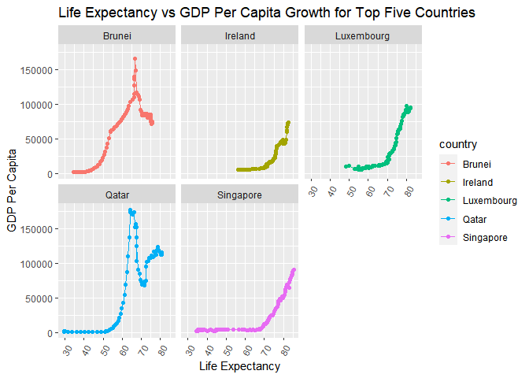

## Instructions
Answer the following questions and complete the exercises in RMarkdown. Please embed all of your code and push your final work to your repository. Your code should be organized, clean, and run free from errors. Be sure to **add your name** to the author header above. You may use any resources to answer these questions (including each other), but you may not post questions to Open Stacks or external help sites. There are 10 total questions.  

Make sure to use the formatting conventions of RMarkdown to make your report neat and clean! Your plots should use consistent aesthetics throughout.  

This exam is due by **12:00p on Tuesday, February 22**.  

## Gapminder
For this assignment, we are going to use data from  [gapminder](https://www.gapminder.org/). Gapminder includes information about economics, population, social issues, and life expectancy from countries all over the world. We will use three data sets, so please load all three as separate objects. 
_Load Libraries_

```r
library(tidyverse)
```

```
## -- Attaching packages --------------------------------------- tidyverse 1.3.1 --
```

```
## v ggplot2 3.3.5     v purrr   0.3.4
## v tibble  3.1.6     v dplyr   1.0.7
## v tidyr   1.1.4     v stringr 1.4.0
## v readr   2.1.1     v forcats 0.5.1
```

```
## -- Conflicts ------------------------------------------ tidyverse_conflicts() --
## x dplyr::filter() masks stats::filter()
## x dplyr::lag()    masks stats::lag()
```

```r
library(janitor)
```

```
## 
## Attaching package: 'janitor'
```

```
## The following objects are masked from 'package:stats':
## 
##     chisq.test, fisher.test
```

```r
library(here)
```

```
## here() starts at C:/Users/Emily/Desktop/GitHub/BIS15W2022_ehuie
```

```r
library(naniar)
library(ggthemes)
```


1. population_total.csv  


```r
pop<-read_csv(here("midterm2", "data", "population_total.csv "))
```

```
## Rows: 195 Columns: 302
```

```
## -- Column specification --------------------------------------------------------
## Delimiter: ","
## chr   (1): country
## dbl (301): 1800, 1801, 1802, 1803, 1804, 1805, 1806, 1807, 1808, 1809, 1810,...
```

```
## 
## i Use `spec()` to retrieve the full column specification for this data.
## i Specify the column types or set `show_col_types = FALSE` to quiet this message.
```

```r
glimpse(pop)
```

```
## Rows: 195
## Columns: 302
## $ country <chr> "Afghanistan", "Albania", "Algeria", "Andorra", "Angola", "Ant~
## $ `1800`  <dbl> 3280000, 400000, 2500000, 2650, 1570000, 37000, 534000, 413000~
## $ `1801`  <dbl> 3280000, 402000, 2510000, 2650, 1570000, 37000, 520000, 413000~
## $ `1802`  <dbl> 3280000, 404000, 2520000, 2650, 1570000, 37000, 506000, 413000~
## $ `1803`  <dbl> 3280000, 405000, 2530000, 2650, 1570000, 37000, 492000, 413000~
## $ `1804`  <dbl> 3280000, 407000, 2540000, 2650, 1570000, 37000, 479000, 413000~
## $ `1805`  <dbl> 3280000, 409000, 2550000, 2650, 1570000, 37000, 466000, 413000~
## $ `1806`  <dbl> 3280000, 411000, 2560000, 2650, 1570000, 37000, 453000, 413000~
## $ `1807`  <dbl> 3280000, 413000, 2560000, 2650, 1570000, 37000, 441000, 413000~
## $ `1808`  <dbl> 3280000, 414000, 2570000, 2650, 1570000, 37000, 429000, 413000~
## $ `1809`  <dbl> 3280000, 416000, 2580000, 2650, 1570000, 37000, 417000, 413000~
## $ `1810`  <dbl> 3280000, 418000, 2590000, 2650, 1570000, 37000, 420000, 413000~
## $ `1811`  <dbl> 3280000, 420000, 2600000, 2650, 1570000, 37000, 422000, 413000~
## $ `1812`  <dbl> 3280000, 422000, 2610000, 2650, 1570000, 37000, 429000, 413000~
## $ `1813`  <dbl> 3280000, 424000, 2620000, 2650, 1570000, 37000, 441000, 413000~
## $ `1814`  <dbl> 3280000, 426000, 2630000, 2650, 1570000, 37000, 453000, 413000~
## $ `1815`  <dbl> 3280000, 427000, 2640000, 2650, 1570000, 37000, 466000, 413000~
## $ `1816`  <dbl> 3280000, 429000, 2650000, 2650, 1570000, 37000, 479000, 413000~
## $ `1817`  <dbl> 3280000, 431000, 2660000, 2650, 1570000, 37000, 492000, 413000~
## $ `1818`  <dbl> 3280000, 433000, 2670000, 2650, 1570000, 37000, 506000, 413000~
## $ `1819`  <dbl> 3280000, 435000, 2680000, 2660, 1570000, 37000, 519000, 414000~
## $ `1820`  <dbl> 3290000, 437000, 2690000, 2670, 1580000, 37000, 531000, 416000~
## $ `1821`  <dbl> 3300000, 439000, 2690000, 2680, 1590000, 37000, 542000, 418000~
## $ `1822`  <dbl> 3310000, 441000, 2700000, 2690, 1610000, 37000, 553000, 421000~
## $ `1823`  <dbl> 3320000, 443000, 2700000, 2710, 1640000, 37000, 562000, 425000~
## $ `1824`  <dbl> 3340000, 445000, 2710000, 2730, 1660000, 37000, 572000, 429000~
## $ `1825`  <dbl> 3350000, 447000, 2710000, 2750, 1690000, 37000, 582000, 433000~
## $ `1826`  <dbl> 3370000, 449000, 2720000, 2770, 1710000, 37000, 592000, 437000~
## $ `1827`  <dbl> 3380000, 451000, 2720000, 2790, 1740000, 37000, 602000, 441000~
## $ `1828`  <dbl> 3400000, 453000, 2730000, 2810, 1760000, 37000, 613000, 445000~
## $ `1829`  <dbl> 3410000, 455000, 2730000, 2830, 1790000, 37000, 624000, 449000~
## $ `1830`  <dbl> 3430000, 457000, 2740000, 2850, 1810000, 37000, 635000, 453000~
## $ `1831`  <dbl> 3450000, 459000, 2740000, 2870, 1840000, 37000, 647000, 457000~
## $ `1832`  <dbl> 3460000, 461000, 2750000, 2890, 1870000, 37000, 659000, 461000~
## $ `1833`  <dbl> 3480000, 463000, 2750000, 2910, 1900000, 37000, 672000, 465000~
## $ `1834`  <dbl> 3490000, 465000, 2760000, 2930, 1920000, 37000, 685000, 470000~
## $ `1835`  <dbl> 3510000, 467000, 2760000, 2950, 1950000, 37000, 698000, 474000~
## $ `1836`  <dbl> 3520000, 470000, 2770000, 2970, 1980000, 37000, 712000, 478000~
## $ `1837`  <dbl> 3540000, 472000, 2770000, 2990, 2010000, 37000, 725000, 483000~
## $ `1838`  <dbl> 3550000, 474000, 2780000, 3010, 2040000, 37000, 739000, 487000~
## $ `1839`  <dbl> 3570000, 476000, 2780000, 3030, 2070000, 37000, 756000, 492000~
## $ `1840`  <dbl> 3590000, 478000, 2790000, 3060, 2100000, 37000, 776000, 496000~
## $ `1841`  <dbl> 3600000, 480000, 2790000, 3080, 2130000, 37000, 800000, 501000~
## $ `1842`  <dbl> 3620000, 482000, 2800000, 3100, 2160000, 37000, 826000, 505000~
## $ `1843`  <dbl> 3630000, 485000, 2800000, 3120, 2190000, 37000, 857000, 510000~
## $ `1844`  <dbl> 3650000, 487000, 2810000, 3140, 2230000, 37000, 888000, 515000~
## $ `1845`  <dbl> 3670000, 489000, 2810000, 3170, 2260000, 37000, 920000, 519000~
## $ `1846`  <dbl> 3680000, 491000, 2820000, 3190, 2290000, 37000, 954000, 524000~
## $ `1847`  <dbl> 3700000, 493000, 2820000, 3210, 2330000, 37000, 989000, 529000~
## $ `1848`  <dbl> 3720000, 496000, 2830000, 3230, 2360000, 37000, 1030000, 53400~
## $ `1849`  <dbl> 3730000, 498000, 2840000, 3260, 2390000, 37000, 1060000, 53900~
## $ `1850`  <dbl> 3750000, 501000, 2850000, 3280, 2420000, 37000, 1090000, 54400~
## $ `1851`  <dbl> 3770000, 505000, 2870000, 3300, 2450000, 37000, 1120000, 54900~
## $ `1852`  <dbl> 3790000, 510000, 2900000, 3320, 2470000, 37000, 1140000, 55300~
## $ `1853`  <dbl> 3810000, 515000, 2920000, 3350, 2490000, 37000, 1160000, 55800~
## $ `1854`  <dbl> 3830000, 520000, 2950000, 3370, 2510000, 37000, 1180000, 56300~
## $ `1855`  <dbl> 3840000, 525000, 2980000, 3390, 2530000, 37000, 1200000, 56800~
## $ `1856`  <dbl> 3860000, 530000, 3010000, 3420, 2550000, 37000, 1220000, 57400~
## $ `1857`  <dbl> 3880000, 535000, 3040000, 3440, 2570000, 37000, 1240000, 57900~
## $ `1858`  <dbl> 3900000, 540000, 3070000, 3460, 2600000, 36900, 1260000, 58400~
## $ `1859`  <dbl> 3920000, 545000, 3100000, 3490, 2620000, 36900, 1290000, 58900~
## $ `1860`  <dbl> 3940000, 551000, 3130000, 3510, 2640000, 36800, 1320000, 59400~
## $ `1861`  <dbl> 3960000, 556000, 3170000, 3540, 2660000, 36700, 1350000, 60000~
## $ `1862`  <dbl> 3980000, 561000, 3200000, 3560, 2680000, 36500, 1390000, 60500~
## $ `1863`  <dbl> 4000000, 567000, 3230000, 3590, 2710000, 36300, 1440000, 61000~
## $ `1864`  <dbl> 4020000, 572000, 3260000, 3610, 2730000, 36100, 1480000, 61600~
## $ `1865`  <dbl> 4040000, 578000, 3290000, 3640, 2750000, 35900, 1530000, 62100~
## $ `1866`  <dbl> 4060000, 584000, 3330000, 3660, 2780000, 35700, 1580000, 62700~
## $ `1867`  <dbl> 4080000, 589000, 3360000, 3690, 2800000, 35500, 1630000, 63300~
## $ `1868`  <dbl> 4100000, 595000, 3390000, 3710, 2820000, 35300, 1680000, 63800~
## $ `1869`  <dbl> 4120000, 601000, 3430000, 3740, 2840000, 35100, 1740000, 64400~
## $ `1870`  <dbl> 4140000, 606000, 3460000, 3760, 2870000, 35000, 1790000, 65000~
## $ `1871`  <dbl> 4160000, 612000, 3500000, 3790, 2890000, 34900, 1850000, 65500~
## $ `1872`  <dbl> 4180000, 618000, 3530000, 3820, 2910000, 34900, 1910000, 66100~
## $ `1873`  <dbl> 4210000, 624000, 3570000, 3840, 2930000, 34900, 1970000, 66700~
## $ `1874`  <dbl> 4230000, 630000, 3600000, 3870, 2940000, 34900, 2030000, 67300~
## $ `1875`  <dbl> 4250000, 636000, 3640000, 3900, 2960000, 34800, 2100000, 67900~
## $ `1876`  <dbl> 4270000, 642000, 3670000, 3920, 2980000, 34800, 2170000, 68500~
## $ `1877`  <dbl> 4290000, 648000, 3710000, 3950, 3000000, 34800, 2240000, 69100~
## $ `1878`  <dbl> 4310000, 655000, 3750000, 3980, 3020000, 34800, 2310000, 69800~
## $ `1879`  <dbl> 4330000, 661000, 3790000, 4010, 3040000, 34900, 2380000, 70400~
## $ `1880`  <dbl> 4350000, 667000, 3820000, 4030, 3060000, 34900, 2460000, 71000~
## $ `1881`  <dbl> 4380000, 674000, 3860000, 4060, 3080000, 35000, 2540000, 71600~
## $ `1882`  <dbl> 4400000, 680000, 3900000, 4090, 3100000, 35200, 2620000, 72300~
## $ `1883`  <dbl> 4420000, 687000, 3940000, 4120, 3120000, 35400, 2700000, 72900~
## $ `1884`  <dbl> 4440000, 693000, 3980000, 4150, 3140000, 35600, 2790000, 73600~
## $ `1885`  <dbl> 4460000, 700000, 4020000, 4170, 3160000, 35800, 2880000, 74200~
## $ `1886`  <dbl> 4490000, 707000, 4060000, 4200, 3180000, 36000, 2970000, 74900~
## $ `1887`  <dbl> 4510000, 714000, 4100000, 4230, 3200000, 36200, 3060000, 75600~
## $ `1888`  <dbl> 4530000, 720000, 4140000, 4260, 3220000, 36300, 3160000, 76300~
## $ `1889`  <dbl> 4550000, 727000, 4180000, 4290, 3230000, 36500, 3260000, 76900~
## $ `1890`  <dbl> 4580000, 735000, 4220000, 4320, 3240000, 36500, 3370000, 77600~
## $ `1891`  <dbl> 4600000, 742000, 4260000, 4350, 3240000, 36400, 3480000, 78300~
## $ `1892`  <dbl> 4620000, 749000, 4300000, 4380, 3240000, 36300, 3600000, 79000~
## $ `1893`  <dbl> 4650000, 757000, 4340000, 4410, 3230000, 36100, 3720000, 79700~
## $ `1894`  <dbl> 4670000, 764000, 4390000, 4440, 3210000, 35900, 3840000, 80400~
## $ `1895`  <dbl> 4690000, 772000, 4430000, 4470, 3200000, 35700, 3970000, 81200~
## $ `1896`  <dbl> 4710000, 780000, 4470000, 4500, 3190000, 35500, 4100000, 81900~
## $ `1897`  <dbl> 4740000, 788000, 4510000, 4540, 3180000, 35300, 4240000, 82600~
## $ `1898`  <dbl> 4760000, 795000, 4560000, 4570, 3170000, 35100, 4380000, 83400~
## $ `1899`  <dbl> 4790000, 803000, 4610000, 4600, 3150000, 34900, 4530000, 84100~
## $ `1900`  <dbl> 4830000, 811000, 4660000, 4630, 3140000, 34600, 4690000, 84900~
## $ `1901`  <dbl> 4880000, 819000, 4730000, 4660, 3120000, 34400, 4860000, 85600~
## $ `1902`  <dbl> 4940000, 826000, 4800000, 4690, 3100000, 34100, 5040000, 86400~
## $ `1903`  <dbl> 5000000, 834000, 4880000, 4730, 3080000, 33800, 5230000, 87100~
## $ `1904`  <dbl> 5060000, 842000, 4950000, 4760, 3060000, 33400, 5430000, 87900~
## $ `1905`  <dbl> 5130000, 849000, 5030000, 4790, 3040000, 33100, 5640000, 88700~
## $ `1906`  <dbl> 5200000, 857000, 5120000, 4830, 3020000, 32800, 5860000, 89500~
## $ `1907`  <dbl> 5260000, 865000, 5200000, 4860, 3000000, 32500, 6080000, 90300~
## $ `1908`  <dbl> 5330000, 873000, 5280000, 4890, 2980000, 32200, 6310000, 91100~
## $ `1909`  <dbl> 5470000, 881000, 5360000, 4940, 2960000, 32000, 6540000, 91900~
## $ `1910`  <dbl> 5680000, 888000, 5420000, 4990, 2950000, 31700, 6760000, 92800~
## $ `1911`  <dbl> 5980000, 895000, 5470000, 5060, 2930000, 31500, 6960000, 93600~
## $ `1912`  <dbl> 6360000, 901000, 5510000, 5150, 2920000, 31200, 7160000, 94400~
## $ `1913`  <dbl> 6850000, 907000, 5530000, 5240, 2920000, 31000, 7350000, 95300~
## $ `1914`  <dbl> 7370000, 913000, 5560000, 5330, 2910000, 30800, 7540000, 96100~
## $ `1915`  <dbl> 7920000, 919000, 5590000, 5430, 2900000, 30600, 7740000, 97000~
## $ `1916`  <dbl> 8520000, 926000, 5620000, 5530, 2890000, 30400, 7940000, 97800~
## $ `1917`  <dbl> 9170000, 932000, 5640000, 5630, 2880000, 30200, 8150000, 98700~
## $ `1918`  <dbl> 9880000, 938000, 5670000, 5740, 2870000, 30000, 8360000, 99600~
## $ `1919`  <dbl> 10300000, 944000, 5710000, 5800, 2870000, 29900, 8590000, 1010~
## $ `1920`  <dbl> 10600000, 949000, 5750000, 5820, 2880000, 29800, 8830000, 1010~
## $ `1921`  <dbl> 10500000, 955000, 5800000, 5800, 2900000, 29800, 9080000, 1020~
## $ `1922`  <dbl> 10300000, 960000, 5860000, 5740, 2940000, 29800, 9350000, 1030~
## $ `1923`  <dbl> 9710000, 965000, 5920000, 5630, 2980000, 29900, 9630000, 10400~
## $ `1924`  <dbl> 9200000, 970000, 5990000, 5530, 3030000, 30000, 9910000, 10500~
## $ `1925`  <dbl> 8720000, 975000, 6050000, 5430, 3070000, 30100, 10200000, 1060~
## $ `1926`  <dbl> 8260000, 980000, 6120000, 5330, 3120000, 30200, 10500000, 1070~
## $ `1927`  <dbl> 7830000, 985000, 6190000, 5240, 3160000, 30300, 10800000, 1080~
## $ `1928`  <dbl> 7420000, 990000, 6260000, 5140, 3210000, 30400, 11200000, 1090~
## $ `1929`  <dbl> 7100000, 997000, 6340000, 5080, 3260000, 30700, 11500000, 1100~
## $ `1930`  <dbl> 6870000, 1000000, 6420000, 5040, 3310000, 31100, 11700000, 111~
## $ `1931`  <dbl> 6720000, 1010000, 6520000, 5040, 3350000, 31800, 12000000, 112~
## $ `1932`  <dbl> 6640000, 1020000, 6630000, 5060, 3400000, 32600, 12200000, 113~
## $ `1933`  <dbl> 6640000, 1030000, 6740000, 5120, 3450000, 33600, 12500000, 114~
## $ `1934`  <dbl> 6640000, 1040000, 6860000, 5170, 3500000, 34600, 12700000, 115~
## $ `1935`  <dbl> 6640000, 1050000, 6990000, 5230, 3550000, 35700, 12900000, 116~
## $ `1936`  <dbl> 6640000, 1060000, 7110000, 5280, 3600000, 36800, 13100000, 117~
## $ `1937`  <dbl> 6640000, 1080000, 7230000, 5340, 3650000, 37900, 13400000, 119~
## $ `1938`  <dbl> 6640000, 1090000, 7360000, 5390, 3700000, 39100, 13600000, 120~
## $ `1939`  <dbl> 6660000, 1100000, 7490000, 5450, 3750000, 40100, 13800000, 121~
## $ `1940`  <dbl> 6700000, 1110000, 7610000, 5510, 3810000, 41000, 14100000, 122~
## $ `1941`  <dbl> 6770000, 1120000, 7730000, 5570, 3870000, 41700, 14400000, 123~
## $ `1942`  <dbl> 6850000, 1140000, 7860000, 5630, 3940000, 42200, 14600000, 124~
## $ `1943`  <dbl> 6950000, 1150000, 7970000, 5690, 4010000, 42600, 14900000, 125~
## $ `1944`  <dbl> 7060000, 1160000, 8090000, 5750, 4080000, 43000, 15200000, 126~
## $ `1945`  <dbl> 7170000, 1180000, 8210000, 5810, 4160000, 43300, 15500000, 127~
## $ `1946`  <dbl> 7280000, 1190000, 8340000, 5870, 4230000, 43700, 15800000, 129~
## $ `1947`  <dbl> 7390000, 1210000, 8460000, 5930, 4310000, 44100, 16100000, 130~
## $ `1948`  <dbl> 7500000, 1220000, 8590000, 5990, 4390000, 44500, 16400000, 131~
## $ `1949`  <dbl> 7620000, 1240000, 8730000, 6080, 4470000, 45000, 16700000, 133~
## $ `1950`  <dbl> 7750000, 1260000, 8870000, 6200, 4550000, 45500, 17000000, 135~
## $ `1951`  <dbl> 7840000, 1290000, 9020000, 6690, 4620000, 46500, 17400000, 138~
## $ `1952`  <dbl> 7940000, 1320000, 9190000, 7250, 4710000, 47400, 17700000, 142~
## $ `1953`  <dbl> 8040000, 1350000, 9360000, 7860, 4820000, 48100, 18100000, 146~
## $ `1954`  <dbl> 8150000, 1380000, 9560000, 8530, 4940000, 48900, 18400000, 151~
## $ `1955`  <dbl> 8270000, 1420000, 9770000, 9230, 5040000, 49600, 18800000, 156~
## $ `1956`  <dbl> 8400000, 1460000, 10000000, 9980, 5140000, 50500, 19100000, 16~
## $ `1957`  <dbl> 8540000, 1500000, 10300000, 10800, 5230000, 51400, 19500000, 1~
## $ `1958`  <dbl> 8680000, 1540000, 10500000, 11600, 5310000, 52300, 19800000, 1~
## $ `1959`  <dbl> 8830000, 1590000, 10800000, 12500, 5380000, 53200, 20100000, 1~
## $ `1960`  <dbl> 9000000, 1640000, 11100000, 13400, 5450000, 54100, 20500000, 1~
## $ `1961`  <dbl> 9170000, 1690000, 11300000, 14400, 5530000, 55000, 20800000, 1~
## $ `1962`  <dbl> 9350000, 1740000, 11600000, 15400, 5610000, 55800, 21200000, 2~
## $ `1963`  <dbl> 9540000, 1790000, 11900000, 16400, 5680000, 56700, 21500000, 2~
## $ `1964`  <dbl> 9740000, 1840000, 12200000, 17500, 5730000, 57600, 21800000, 2~
## $ `1965`  <dbl> 9960000, 1900000, 12600000, 18500, 5770000, 58700, 22200000, 2~
## $ `1966`  <dbl> 10200000, 1950000, 12900000, 19600, 5780000, 59900, 22500000, ~
## $ `1967`  <dbl> 10400000, 2000000, 13300000, 20800, 5770000, 61200, 22800000, ~
## $ `1968`  <dbl> 10600000, 2050000, 13700000, 21900, 5770000, 62500, 23200000, ~
## $ `1969`  <dbl> 10900000, 2100000, 14100000, 23100, 5800000, 63600, 23500000, ~
## $ `1970`  <dbl> 11200000, 2150000, 14500000, 24300, 5890000, 64200, 23900000, ~
## $ `1971`  <dbl> 11500000, 2200000, 14900000, 25600, 6040000, 64400, 24300000, ~
## $ `1972`  <dbl> 11800000, 2250000, 15300000, 26900, 6250000, 64100, 24700000, ~
## $ `1973`  <dbl> 1.21e+07, 2.31e+06, 1.57e+07, 2.82e+04, 6.50e+06, 6.36e+04, 2.~
## $ `1974`  <dbl> 1.24e+07, 2.36e+06, 1.61e+07, 2.95e+04, 6.76e+06, 6.31e+04, 2.~
## $ `1975`  <dbl> 1.27e+07, 2.41e+06, 1.66e+07, 3.07e+04, 7.02e+06, 6.27e+04, 2.~
## $ `1976`  <dbl> 1.29e+07, 2.46e+06, 1.71e+07, 3.18e+04, 7.28e+06, 6.24e+04, 2.~
## $ `1977`  <dbl> 1.32e+07, 2.52e+06, 1.76e+07, 3.28e+04, 7.53e+06, 6.22e+04, 2.~
## $ `1978`  <dbl> 1.33e+07, 2.57e+06, 1.81e+07, 3.37e+04, 7.79e+06, 6.20e+04, 2.~
## $ `1979`  <dbl> 1.34e+07, 2.63e+06, 1.86e+07, 3.48e+04, 8.06e+06, 6.19e+04, 2.~
## $ `1980`  <dbl> 1.34e+07, 2.68e+06, 1.92e+07, 3.61e+04, 8.34e+06, 6.19e+04, 2.~
## $ `1981`  <dbl> 1.32e+07, 2.74e+06, 1.98e+07, 3.75e+04, 8.64e+06, 6.18e+04, 2.~
## $ `1982`  <dbl> 1.29e+07, 2.79e+06, 2.05e+07, 3.91e+04, 8.95e+06, 6.18e+04, 2.~
## $ `1983`  <dbl> 1.25e+07, 2.84e+06, 2.11e+07, 4.09e+04, 9.28e+06, 6.18e+04, 2.~
## $ `1984`  <dbl> 1.22e+07, 2.90e+06, 2.18e+07, 4.27e+04, 9.61e+06, 6.18e+04, 2.~
## $ `1985`  <dbl> 1.19e+07, 2.97e+06, 2.24e+07, 4.46e+04, 9.96e+06, 6.18e+04, 3.~
## $ `1986`  <dbl> 1.17e+07, 3.04e+06, 2.31e+07, 4.65e+04, 1.03e+07, 6.18e+04, 3.~
## $ `1987`  <dbl> 1.16e+07, 3.12e+06, 2.38e+07, 4.85e+04, 1.07e+07, 6.17e+04, 3.~
## $ `1988`  <dbl> 1.16e+07, 3.20e+06, 2.44e+07, 5.04e+04, 1.11e+07, 6.18e+04, 3.~
## $ `1989`  <dbl> 1.19e+07, 3.26e+06, 2.51e+07, 5.25e+04, 1.15e+07, 6.20e+04, 3.~
## $ `1990`  <dbl> 1.24e+07, 3.29e+06, 2.58e+07, 5.45e+04, 1.18e+07, 6.25e+04, 3.~
## $ `1991`  <dbl> 1.33e+07, 3.28e+06, 2.64e+07, 5.67e+04, 1.22e+07, 6.34e+04, 3.~
## $ `1992`  <dbl> 1.45e+07, 3.25e+06, 2.70e+07, 5.89e+04, 1.27e+07, 6.45e+04, 3.~
## $ `1993`  <dbl> 1.58e+07, 3.20e+06, 2.76e+07, 6.10e+04, 1.31e+07, 6.58e+04, 3.~
## $ `1994`  <dbl> 1.71e+07, 3.15e+06, 2.82e+07, 6.27e+04, 1.35e+07, 6.72e+04, 3.~
## $ `1995`  <dbl> 1.81e+07, 3.11e+06, 2.88e+07, 6.39e+04, 1.39e+07, 6.87e+04, 3.~
## $ `1996`  <dbl> 1.89e+07, 3.10e+06, 2.93e+07, 6.44e+04, 1.44e+07, 7.02e+04, 3.~
## $ `1997`  <dbl> 1.94e+07, 3.10e+06, 2.97e+07, 6.43e+04, 1.49e+07, 7.17e+04, 3.~
## $ `1998`  <dbl> 1.97e+07, 3.11e+06, 3.02e+07, 6.41e+04, 1.54e+07, 7.32e+04, 3.~
## $ `1999`  <dbl> 2.02e+07, 3.12e+06, 3.06e+07, 6.44e+04, 1.59e+07, 7.47e+04, 3.~
## $ `2000`  <dbl> 2.08e+07, 3.13e+06, 3.10e+07, 6.54e+04, 1.64e+07, 7.60e+04, 3.~
## $ `2001`  <dbl> 2.16e+07, 3.13e+06, 3.15e+07, 6.73e+04, 1.69e+07, 7.72e+04, 3.~
## $ `2002`  <dbl> 2.26e+07, 3.13e+06, 3.19e+07, 7.00e+04, 1.75e+07, 7.83e+04, 3.~
## $ `2003`  <dbl> 2.37e+07, 3.12e+06, 3.23e+07, 7.32e+04, 1.81e+07, 7.93e+04, 3.~
## $ `2004`  <dbl> 2.47e+07, 3.10e+06, 3.27e+07, 7.63e+04, 1.88e+07, 8.03e+04, 3.~
## $ `2005`  <dbl> 2.57e+07, 3.09e+06, 3.31e+07, 7.89e+04, 1.94e+07, 8.15e+04, 3.~
## $ `2006`  <dbl> 2.64e+07, 3.06e+06, 3.36e+07, 8.10e+04, 2.01e+07, 8.27e+04, 3.~
## $ `2007`  <dbl> 2.71e+07, 3.03e+06, 3.42e+07, 8.27e+04, 2.09e+07, 8.40e+04, 3.~
## $ `2008`  <dbl> 2.77e+07, 3.00e+06, 3.47e+07, 8.39e+04, 2.17e+07, 8.54e+04, 4.~
## $ `2009`  <dbl> 2.84e+07, 2.97e+06, 3.53e+07, 8.45e+04, 2.25e+07, 8.67e+04, 4.~
## $ `2010`  <dbl> 2.92e+07, 2.95e+06, 3.60e+07, 8.45e+04, 2.34e+07, 8.80e+04, 4.~
## $ `2011`  <dbl> 3.01e+07, 2.93e+06, 3.67e+07, 8.37e+04, 2.42e+07, 8.93e+04, 4.~
## $ `2012`  <dbl> 3.12e+07, 2.91e+06, 3.74e+07, 8.24e+04, 2.51e+07, 9.04e+04, 4.~
## $ `2013`  <dbl> 3.23e+07, 2.90e+06, 3.81e+07, 8.08e+04, 2.60e+07, 9.15e+04, 4.~
## $ `2014`  <dbl> 3.34e+07, 2.90e+06, 3.89e+07, 7.92e+04, 2.69e+07, 9.26e+04, 4.~
## $ `2015`  <dbl> 3.44e+07, 2.89e+06, 3.97e+07, 7.80e+04, 2.79e+07, 9.36e+04, 4.~
## $ `2016`  <dbl> 3.54e+07, 2.89e+06, 4.06e+07, 7.73e+04, 2.88e+07, 9.45e+04, 4.~
## $ `2017`  <dbl> 3.63e+07, 2.88e+06, 4.14e+07, 7.70e+04, 2.98e+07, 9.54e+04, 4.~
## $ `2018`  <dbl> 3.72e+07, 2.88e+06, 4.22e+07, 7.70e+04, 3.08e+07, 9.63e+04, 4.~
## $ `2019`  <dbl> 3.80e+07, 2.88e+06, 4.31e+07, 7.71e+04, 3.18e+07, 9.71e+04, 4.~
## $ `2020`  <dbl> 3.89e+07, 2.88e+06, 4.39e+07, 7.73e+04, 3.29e+07, 9.79e+04, 4.~
## $ `2021`  <dbl> 3.98e+07, 2.87e+06, 4.46e+07, 7.74e+04, 3.39e+07, 9.87e+04, 4.~
## $ `2022`  <dbl> 4.08e+07, 2.87e+06, 4.54e+07, 7.75e+04, 3.50e+07, 9.95e+04, 4.~
## $ `2023`  <dbl> 4.17e+07, 2.86e+06, 4.61e+07, 7.76e+04, 3.61e+07, 1.00e+05, 4.~
## $ `2024`  <dbl> 4.26e+07, 2.85e+06, 4.67e+07, 7.77e+04, 3.73e+07, 1.01e+05, 4.~
## $ `2025`  <dbl> 4.35e+07, 2.84e+06, 4.74e+07, 7.78e+04, 3.85e+07, 1.02e+05, 4.~
## $ `2026`  <dbl> 4.44e+07, 2.83e+06, 4.80e+07, 7.79e+04, 3.97e+07, 1.02e+05, 4.~
## $ `2027`  <dbl> 4.54e+07, 2.82e+06, 4.86e+07, 7.79e+04, 4.09e+07, 1.03e+05, 4.~
## $ `2028`  <dbl> 4.63e+07, 2.81e+06, 4.92e+07, 7.79e+04, 4.22e+07, 1.04e+05, 4.~
## $ `2029`  <dbl> 4.72e+07, 2.80e+06, 4.98e+07, 7.79e+04, 4.35e+07, 1.04e+05, 4.~
## $ `2030`  <dbl> 4.81e+07, 2.79e+06, 5.04e+07, 7.79e+04, 4.48e+07, 1.05e+05, 4.~
## $ `2031`  <dbl> 4.90e+07, 2.77e+06, 5.09e+07, 7.79e+04, 4.62e+07, 1.05e+05, 4.~
## $ `2032`  <dbl> 4.99e+07, 2.76e+06, 5.14e+07, 7.80e+04, 4.76e+07, 1.06e+05, 4.~
## $ `2033`  <dbl> 5.08e+07, 2.75e+06, 5.20e+07, 7.80e+04, 4.90e+07, 1.06e+05, 5.~
## $ `2034`  <dbl> 5.17e+07, 2.74e+06, 5.25e+07, 7.80e+04, 5.05e+07, 1.07e+05, 5.~
## $ `2035`  <dbl> 5.26e+07, 2.72e+06, 5.30e+07, 7.80e+04, 5.20e+07, 1.07e+05, 5.~
## $ `2036`  <dbl> 5.35e+07, 2.71e+06, 5.35e+07, 7.80e+04, 5.35e+07, 1.08e+05, 5.~
## $ `2037`  <dbl> 5.43e+07, 2.69e+06, 5.41e+07, 7.80e+04, 5.50e+07, 1.08e+05, 5.~
## $ `2038`  <dbl> 5.52e+07, 2.67e+06, 5.46e+07, 7.79e+04, 5.66e+07, 1.08e+05, 5.~
## $ `2039`  <dbl> 5.61e+07, 2.65e+06, 5.51e+07, 7.79e+04, 5.82e+07, 1.09e+05, 5.~
## $ `2040`  <dbl> 5.69e+07, 2.63e+06, 5.56e+07, 7.79e+04, 5.98e+07, 1.09e+05, 5.~
## $ `2041`  <dbl> 5.77e+07, 2.62e+06, 5.62e+07, 7.78e+04, 6.14e+07, 1.09e+05, 5.~
## $ `2042`  <dbl> 5.86e+07, 2.60e+06, 5.67e+07, 7.77e+04, 6.31e+07, 1.10e+05, 5.~
## $ `2043`  <dbl> 5.94e+07, 2.58e+06, 5.73e+07, 7.76e+04, 6.48e+07, 1.10e+05, 5.~
## $ `2044`  <dbl> 6.02e+07, 2.55e+06, 5.78e+07, 7.75e+04, 6.65e+07, 1.10e+05, 5.~
## $ `2045`  <dbl> 6.10e+07, 2.53e+06, 5.83e+07, 7.73e+04, 6.83e+07, 1.10e+05, 5.~
## $ `2046`  <dbl> 6.17e+07, 2.51e+06, 5.89e+07, 7.71e+04, 7.01e+07, 1.10e+05, 5.~
## $ `2047`  <dbl> 6.25e+07, 2.49e+06, 5.94e+07, 7.69e+04, 7.19e+07, 1.11e+05, 5.~
## $ `2048`  <dbl> 6.32e+07, 2.47e+06, 5.99e+07, 7.67e+04, 7.37e+07, 1.11e+05, 5.~
## $ `2049`  <dbl> 6.40e+07, 2.45e+06, 6.04e+07, 7.64e+04, 7.55e+07, 1.11e+05, 5.~
## $ `2050`  <dbl> 6.47e+07, 2.42e+06, 6.09e+07, 7.61e+04, 7.74e+07, 1.11e+05, 5.~
## $ `2051`  <dbl> 6.54e+07, 2.40e+06, 6.14e+07, 7.58e+04, 7.93e+07, 1.11e+05, 5.~
## $ `2052`  <dbl> 6.61e+07, 2.38e+06, 6.19e+07, 7.54e+04, 8.12e+07, 1.11e+05, 5.~
## $ `2053`  <dbl> 6.67e+07, 2.36e+06, 6.23e+07, 7.51e+04, 8.32e+07, 1.11e+05, 5.~
## $ `2054`  <dbl> 6.74e+07, 2.33e+06, 6.28e+07, 7.46e+04, 8.51e+07, 1.11e+05, 5.~
## $ `2055`  <dbl> 6.80e+07, 2.31e+06, 6.32e+07, 7.42e+04, 8.71e+07, 1.11e+05, 5.~
## $ `2056`  <dbl> 6.86e+07, 2.29e+06, 6.36e+07, 7.38e+04, 8.91e+07, 1.11e+05, 5.~
## $ `2057`  <dbl> 6.92e+07, 2.26e+06, 6.40e+07, 7.33e+04, 9.11e+07, 1.11e+05, 5.~
## $ `2058`  <dbl> 6.98e+07, 2.24e+06, 6.43e+07, 7.28e+04, 9.32e+07, 1.11e+05, 5.~
## $ `2059`  <dbl> 7.03e+07, 2.21e+06, 6.47e+07, 7.23e+04, 9.53e+07, 1.11e+05, 5.~
## $ `2060`  <dbl> 7.08e+07, 2.19e+06, 6.50e+07, 7.18e+04, 9.73e+07, 1.11e+05, 5.~
## $ `2061`  <dbl> 7.14e+07, 2.17e+06, 6.53e+07, 7.13e+04, 9.95e+07, 1.11e+05, 5.~
## $ `2062`  <dbl> 7.18e+07, 2.14e+06, 6.56e+07, 7.08e+04, 1.02e+08, 1.10e+05, 5.~
## $ `2063`  <dbl> 7.23e+07, 2.12e+06, 6.58e+07, 7.02e+04, 1.04e+08, 1.10e+05, 5.~
## $ `2064`  <dbl> 7.28e+07, 2.09e+06, 6.61e+07, 6.97e+04, 1.06e+08, 1.10e+05, 5.~
## $ `2065`  <dbl> 7.32e+07, 2.07e+06, 6.63e+07, 6.92e+04, 1.08e+08, 1.10e+05, 5.~
## $ `2066`  <dbl> 7.36e+07, 2.04e+06, 6.66e+07, 6.87e+04, 1.10e+08, 1.10e+05, 5.~
## $ `2067`  <dbl> 7.40e+07, 2.02e+06, 6.68e+07, 6.83e+04, 1.12e+08, 1.10e+05, 5.~
## $ `2068`  <dbl> 7.43e+07, 1.99e+06, 6.70e+07, 6.78e+04, 1.15e+08, 1.10e+05, 5.~
## $ `2069`  <dbl> 7.47e+07, 1.97e+06, 6.72e+07, 6.74e+04, 1.17e+08, 1.09e+05, 5.~
## $ `2070`  <dbl> 7.50e+07, 1.94e+06, 6.74e+07, 6.69e+04, 1.19e+08, 1.09e+05, 5.~
## $ `2071`  <dbl> 7.53e+07, 1.92e+06, 6.75e+07, 6.65e+04, 1.21e+08, 1.09e+05, 5.~
## $ `2072`  <dbl> 7.55e+07, 1.89e+06, 6.77e+07, 6.62e+04, 1.24e+08, 1.09e+05, 5.~
## $ `2073`  <dbl> 7.58e+07, 1.86e+06, 6.79e+07, 6.58e+04, 1.26e+08, 1.09e+05, 5.~
## $ `2074`  <dbl> 7.60e+07, 1.83e+06, 6.81e+07, 6.55e+04, 1.28e+08, 1.09e+05, 5.~
## $ `2075`  <dbl> 7.62e+07, 1.81e+06, 6.82e+07, 6.52e+04, 1.31e+08, 1.08e+05, 5.~
## $ `2076`  <dbl> 7.64e+07, 1.78e+06, 6.84e+07, 6.49e+04, 1.33e+08, 1.08e+05, 5.~
## $ `2077`  <dbl> 7.65e+07, 1.75e+06, 6.86e+07, 6.46e+04, 1.35e+08, 1.08e+05, 5.~
## $ `2078`  <dbl> 7.67e+07, 1.72e+06, 6.87e+07, 6.44e+04, 1.37e+08, 1.08e+05, 5.~
## $ `2079`  <dbl> 7.68e+07, 1.69e+06, 6.89e+07, 6.42e+04, 1.40e+08, 1.08e+05, 5.~
## $ `2080`  <dbl> 7.69e+07, 1.66e+06, 6.90e+07, 6.40e+04, 1.42e+08, 1.07e+05, 5.~
## $ `2081`  <dbl> 7.69e+07, 1.63e+06, 6.92e+07, 6.39e+04, 1.44e+08, 1.07e+05, 5.~
## $ `2082`  <dbl> 7.70e+07, 1.60e+06, 6.93e+07, 6.37e+04, 1.47e+08, 1.07e+05, 5.~
## $ `2083`  <dbl> 7.70e+07, 1.57e+06, 6.95e+07, 6.36e+04, 1.49e+08, 1.07e+05, 5.~
## $ `2084`  <dbl> 7.70e+07, 1.54e+06, 6.96e+07, 6.35e+04, 1.51e+08, 1.06e+05, 5.~
## $ `2085`  <dbl> 7.70e+07, 1.51e+06, 6.97e+07, 6.34e+04, 1.54e+08, 1.06e+05, 5.~
## $ `2086`  <dbl> 7.70e+07, 1.48e+06, 6.99e+07, 6.33e+04, 1.56e+08, 1.06e+05, 5.~
## $ `2087`  <dbl> 7.69e+07, 1.45e+06, 7.00e+07, 6.33e+04, 1.58e+08, 1.06e+05, 5.~
## $ `2088`  <dbl> 7.69e+07, 1.42e+06, 7.01e+07, 6.32e+04, 1.61e+08, 1.05e+05, 5.~
## $ `2089`  <dbl> 7.68e+07, 1.39e+06, 7.02e+07, 6.31e+04, 1.63e+08, 1.05e+05, 5.~
## $ `2090`  <dbl> 7.67e+07, 1.36e+06, 7.03e+07, 6.31e+04, 1.65e+08, 1.05e+05, 5.~
## $ `2091`  <dbl> 7.66e+07, 1.33e+06, 7.04e+07, 6.30e+04, 1.68e+08, 1.05e+05, 5.~
## $ `2092`  <dbl> 7.64e+07, 1.30e+06, 7.05e+07, 6.29e+04, 1.70e+08, 1.04e+05, 5.~
## $ `2093`  <dbl> 7.63e+07, 1.27e+06, 7.05e+07, 6.29e+04, 1.72e+08, 1.04e+05, 5.~
## $ `2094`  <dbl> 7.61e+07, 1.25e+06, 7.06e+07, 6.28e+04, 1.75e+08, 1.04e+05, 5.~
## $ `2095`  <dbl> 7.60e+07, 1.22e+06, 7.07e+07, 6.27e+04, 1.77e+08, 1.04e+05, 5.~
## $ `2096`  <dbl> 7.58e+07, 1.19e+06, 7.07e+07, 6.27e+04, 1.79e+08, 1.03e+05, 5.~
## $ `2097`  <dbl> 7.56e+07, 1.17e+06, 7.07e+07, 6.26e+04, 1.82e+08, 1.03e+05, 5.~
## $ `2098`  <dbl> 7.54e+07, 1.14e+06, 7.07e+07, 6.25e+04, 1.84e+08, 1.03e+05, 5.~
## $ `2099`  <dbl> 7.52e+07, 1.11e+06, 7.07e+07, 6.25e+04, 1.86e+08, 1.02e+05, 5.~
## $ `2100`  <dbl> 7.49e+07, 1.09e+06, 7.07e+07, 6.24e+04, 1.88e+08, 1.02e+05, 5.~
```

2. income_per_person_gdppercapita_ppp_inflation_adjusted.csv  

```r
income<-read_csv(here("midterm2", "data", "income_per_person_gdppercapita_ppp_inflation_adjusted.csv"))
```

```
## Rows: 193 Columns: 242
```

```
## -- Column specification --------------------------------------------------------
## Delimiter: ","
## chr   (1): country
## dbl (241): 1800, 1801, 1802, 1803, 1804, 1805, 1806, 1807, 1808, 1809, 1810,...
```

```
## 
## i Use `spec()` to retrieve the full column specification for this data.
## i Specify the column types or set `show_col_types = FALSE` to quiet this message.
```

```r
income
```

```
## # A tibble: 193 x 242
##    country `1800` `1801` `1802` `1803` `1804` `1805` `1806` `1807` `1808` `1809`
##    <chr>    <dbl>  <dbl>  <dbl>  <dbl>  <dbl>  <dbl>  <dbl>  <dbl>  <dbl>  <dbl>
##  1 Afghan~    603    603    603    603    603    603    603    603    603    603
##  2 Albania    667    667    667    667    667    668    668    668    668    668
##  3 Algeria    715    716    717    718    719    720    721    722    723    724
##  4 Andorra   1200   1200   1200   1200   1210   1210   1210   1210   1220   1220
##  5 Angola     618    620    623    626    628    631    634    637    640    642
##  6 Antigu~    757    757    757    757    757    757    757    758    758    758
##  7 Argent~   1640   1640   1650   1650   1660   1660   1670   1680   1680   1690
##  8 Armenia    514    514    514    514    514    514    514    514    514    514
##  9 Austra~    817    822    826    831    836    841    845    850    855    860
## 10 Austria   1850   1850   1860   1870   1880   1880   1890   1900   1910   1920
## # ... with 183 more rows, and 231 more variables: 1810 <dbl>, 1811 <dbl>,
## #   1812 <dbl>, 1813 <dbl>, 1814 <dbl>, 1815 <dbl>, 1816 <dbl>, 1817 <dbl>,
## #   1818 <dbl>, 1819 <dbl>, 1820 <dbl>, 1821 <dbl>, 1822 <dbl>, 1823 <dbl>,
## #   1824 <dbl>, 1825 <dbl>, 1826 <dbl>, 1827 <dbl>, 1828 <dbl>, 1829 <dbl>,
## #   1830 <dbl>, 1831 <dbl>, 1832 <dbl>, 1833 <dbl>, 1834 <dbl>, 1835 <dbl>,
## #   1836 <dbl>, 1837 <dbl>, 1838 <dbl>, 1839 <dbl>, 1840 <dbl>, 1841 <dbl>,
## #   1842 <dbl>, 1843 <dbl>, 1844 <dbl>, 1845 <dbl>, 1846 <dbl>, 1847 <dbl>, ...
```

3. life_expectancy_years.csv  

```r
life_exp<-read_csv(here("midterm2", "data", "life_expectancy_years.csv"))
```

```
## Rows: 187 Columns: 302
```

```
## -- Column specification --------------------------------------------------------
## Delimiter: ","
## chr   (1): country
## dbl (301): 1800, 1801, 1802, 1803, 1804, 1805, 1806, 1807, 1808, 1809, 1810,...
```

```
## 
## i Use `spec()` to retrieve the full column specification for this data.
## i Specify the column types or set `show_col_types = FALSE` to quiet this message.
```

```r
life_exp
```

```
## # A tibble: 187 x 302
##    country `1800` `1801` `1802` `1803` `1804` `1805` `1806` `1807` `1808` `1809`
##    <chr>    <dbl>  <dbl>  <dbl>  <dbl>  <dbl>  <dbl>  <dbl>  <dbl>  <dbl>  <dbl>
##  1 Afghan~   28.2   28.2   28.2   28.2   28.2   28.2   28.1   28.1   28.1   28.1
##  2 Albania   35.4   35.4   35.4   35.4   35.4   35.4   35.4   35.4   35.4   35.4
##  3 Algeria   28.8   28.8   28.8   28.8   28.8   28.8   28.8   28.8   28.8   28.8
##  4 Andorra   NA     NA     NA     NA     NA     NA     NA     NA     NA     NA  
##  5 Angola    27     27     27     27     27     27     27     27     27     27  
##  6 Antigu~   33.5   33.5   33.5   33.5   33.5   33.5   33.5   33.5   33.5   33.5
##  7 Argent~   33.2   33.2   33.2   33.2   33.2   33.2   33.2   33.2   33.2   33.2
##  8 Armenia   34     34     34     34     34     34     34     34     34     34  
##  9 Austra~   34     34     34     34     34     34     34     34     34     34  
## 10 Austria   34.4   34.4   34.4   34.4   34.4   34.4   34.4   34.4   34.4   34.4
## # ... with 177 more rows, and 291 more variables: 1810 <dbl>, 1811 <dbl>,
## #   1812 <dbl>, 1813 <dbl>, 1814 <dbl>, 1815 <dbl>, 1816 <dbl>, 1817 <dbl>,
## #   1818 <dbl>, 1819 <dbl>, 1820 <dbl>, 1821 <dbl>, 1822 <dbl>, 1823 <dbl>,
## #   1824 <dbl>, 1825 <dbl>, 1826 <dbl>, 1827 <dbl>, 1828 <dbl>, 1829 <dbl>,
## #   1830 <dbl>, 1831 <dbl>, 1832 <dbl>, 1833 <dbl>, 1834 <dbl>, 1835 <dbl>,
## #   1836 <dbl>, 1837 <dbl>, 1838 <dbl>, 1839 <dbl>, 1840 <dbl>, 1841 <dbl>,
## #   1842 <dbl>, 1843 <dbl>, 1844 <dbl>, 1845 <dbl>, 1846 <dbl>, 1847 <dbl>, ...
```


1. (3 points) Once you have an idea of the structure of the data, please make each data set tidy (hint: think back to pivots) and store them as new objects. You will need both the original (wide) and tidy (long) data!  

_Population_

```r
pop_long<- pop%>%
  pivot_longer(-country, names_to="year", values_to="population")
pop_long
```

```
## # A tibble: 58,695 x 3
##    country     year  population
##    <chr>       <chr>      <dbl>
##  1 Afghanistan 1800     3280000
##  2 Afghanistan 1801     3280000
##  3 Afghanistan 1802     3280000
##  4 Afghanistan 1803     3280000
##  5 Afghanistan 1804     3280000
##  6 Afghanistan 1805     3280000
##  7 Afghanistan 1806     3280000
##  8 Afghanistan 1807     3280000
##  9 Afghanistan 1808     3280000
## 10 Afghanistan 1809     3280000
## # ... with 58,685 more rows
```

_Economic_

```r
income_long<- income%>%
  pivot_longer(-country, names_to="year", values_to="gdp_per_capita")
income_long
```

```
## # A tibble: 46,513 x 3
##    country     year  gdp_per_capita
##    <chr>       <chr>          <dbl>
##  1 Afghanistan 1800             603
##  2 Afghanistan 1801             603
##  3 Afghanistan 1802             603
##  4 Afghanistan 1803             603
##  5 Afghanistan 1804             603
##  6 Afghanistan 1805             603
##  7 Afghanistan 1806             603
##  8 Afghanistan 1807             603
##  9 Afghanistan 1808             603
## 10 Afghanistan 1809             603
## # ... with 46,503 more rows
```
_Life Expectancy_

```r
life_exp_long<- life_exp%>%
  pivot_longer(-country, names_to="year", values_to="life_expectancy")
life_exp_long
```

```
## # A tibble: 56,287 x 3
##    country     year  life_expectancy
##    <chr>       <chr>           <dbl>
##  1 Afghanistan 1800             28.2
##  2 Afghanistan 1801             28.2
##  3 Afghanistan 1802             28.2
##  4 Afghanistan 1803             28.2
##  5 Afghanistan 1804             28.2
##  6 Afghanistan 1805             28.2
##  7 Afghanistan 1806             28.1
##  8 Afghanistan 1807             28.1
##  9 Afghanistan 1808             28.1
## 10 Afghanistan 1809             28.1
## # ... with 56,277 more rows
```

2. (1 point) How many different countries are represented in the data? Provide the total number and their names. Since each data set includes different numbers of countries, you will need to do this for each one.  
_Population_

```r
pop_long%>%
  group_by(country)%>%
  summarise(n=n_distinct(country))%>%
  summarise(number_countries_sampled=sum(n))
```

```
## # A tibble: 1 x 1
##   number_countries_sampled
##                      <int>
## 1                      195
```

```r
pop_long%>%
  group_by(country)%>%
  summarise(n=n_distinct(country))
```

```
## # A tibble: 195 x 2
##    country                 n
##    <chr>               <int>
##  1 Afghanistan             1
##  2 Albania                 1
##  3 Algeria                 1
##  4 Andorra                 1
##  5 Angola                  1
##  6 Antigua and Barbuda     1
##  7 Argentina               1
##  8 Armenia                 1
##  9 Australia               1
## 10 Austria                 1
## # ... with 185 more rows
```


_Economics_

```r
income_long%>%
  group_by(country)%>%
  summarise(n=n_distinct(country))%>%
  summarise(number_countries_sampled=sum(n))
```

```
## # A tibble: 1 x 1
##   number_countries_sampled
##                      <int>
## 1                      193
```

```r
income_long%>%
  group_by(country)%>%
  summarise(n=n_distinct(country))
```

```
## # A tibble: 193 x 2
##    country                 n
##    <chr>               <int>
##  1 Afghanistan             1
##  2 Albania                 1
##  3 Algeria                 1
##  4 Andorra                 1
##  5 Angola                  1
##  6 Antigua and Barbuda     1
##  7 Argentina               1
##  8 Armenia                 1
##  9 Australia               1
## 10 Austria                 1
## # ... with 183 more rows
```

_Life Expectancy_

```r
life_exp_long%>%
  group_by(country)%>%
  summarise(n=n_distinct(country))%>%
  summarise(number_countries_sampled=sum(n))
```

```
## # A tibble: 1 x 1
##   number_countries_sampled
##                      <int>
## 1                      187
```


```r
life_exp_long%>%
  group_by(country)%>%
  summarise(n=n_distinct(country))
```

```
## # A tibble: 187 x 2
##    country                 n
##    <chr>               <int>
##  1 Afghanistan             1
##  2 Albania                 1
##  3 Algeria                 1
##  4 Andorra                 1
##  5 Angola                  1
##  6 Antigua and Barbuda     1
##  7 Argentina               1
##  8 Armenia                 1
##  9 Australia               1
## 10 Austria                 1
## # ... with 177 more rows
```

## Life Expectancy  

3. (2 points) Let's limit the data to 100 years (1920-2020). For these years, which country has the highest average life expectancy? How about the lowest average life expectancy?  

Andorra (79.77)
Central African Republic (41. 766)


```r
life_exp_long%>%
  filter(!is.na(life_expectancy),between(year, 1920,2020))%>%
  group_by(country)%>%
  summarise(mean_life_expectancy=mean(life_expectancy))%>%
  arrange(desc(mean_life_expectancy))
```

```
## # A tibble: 187 x 2
##    country     mean_life_expectancy
##    <chr>                      <dbl>
##  1 Andorra                     79.8
##  2 Sweden                      73.5
##  3 Norway                      73.2
##  4 Netherlands                 73.0
##  5 Dominica                    73.0
##  6 Iceland                     72.9
##  7 Australia                   72.7
##  8 Switzerland                 72.7
##  9 Denmark                     71.9
## 10 Canada                      71.8
## # ... with 177 more rows
```


4. (3 points) Although we can see which country has the highest life expectancy for the past 100 years, we don't know which countries have changed the most. What are the top 5 countries that have experienced the biggest improvement in life expectancy between 1920-2020?  

```r
life_exp_long%>%
  filter(!is.na(life_expectancy), year %in% c(1920,2020))%>%
  group_by(country)%>%
  summarise(life_exp_growth=(max(life_expectancy)-min(life_expectancy)))%>%
  arrange(desc(life_exp_growth))
```

```
## # A tibble: 184 x 2
##    country         life_exp_growth
##    <chr>                     <dbl>
##  1 Kuwait                     56.8
##  2 Kyrgyz Republic            56.5
##  3 Turkmenistan               55.3
##  4 South Korea                55  
##  5 Tajikistan                 54.3
##  6 Nicaragua                  54.2
##  7 Kazakhstan                 53.8
##  8 Russia                     52.2
##  9 Israel                     51.4
## 10 Iran                       51.2
## # ... with 174 more rows
```

5. (3 points) Make a plot that shows the change over the past 100 years for the country with the biggest improvement in life expectancy. Be sure to add appropriate aesthetics to make the plot clean and clear. Once you have made the plot, do a little internet searching and see if you can discover what historical event may have contributed to this remarkable change.  

```r
life_exp_long%>%
  filter(country=="Kuwait", !is.na(life_expectancy), between(year, 1920,2020))%>%
  ggplot(aes(x=as.factor(year),y=life_expectancy))+geom_point()+geom_line()+theme(axis.text.x=element_text(angle=60, hjust=1))+labs(title="Kuwait: Country with Biggest Improvement in Life Expectancy", x="Year", y="Life Expectancy")
```

```
## geom_path: Each group consists of only one observation. Do you need to adjust
## the group aesthetic?
```

<!-- -->


## Population Growth
6. (3 points) Which 5 countries have had the highest population growth over the past 100 years (1920-2020)?  
India
China
Indonesia
United States
Pakistan

```r
pop_long%>%
  filter(!is.na(population), year %in% c(1920,2020))%>%
  group_by(country)%>%
  summarise(pop_growth=(max(population)-min(population)))%>%
  arrange(desc(pop_growth))%>%
  head(n=5)
```

```
## # A tibble: 5 x 2
##   country       pop_growth
##   <chr>              <dbl>
## 1 India         1063000000
## 2 China          968000000
## 3 Indonesia      226700000
## 4 United States  220000000
## 5 Pakistan       199300000
```


7. (4 points) Produce a plot that shows the 5 countries that have had the highest population growth over the past 100 years (1920-2020). Which countries appear to have had exponential growth?  

```r
options(scipen=999)
```


```r
pop_long%>%
  filter(country %in% c("China", "India", "United States", "Indonesia", "Pakistan", between(year, 1920,2020)))%>%
  ggplot(aes(x=as.factor(year), y=population, group=country, color=country))+geom_point()+geom_line()+theme(axis.text.x=element_text(angle=75, hjust=1, size=4))+labs(title="Population Growth for Top Five Countries from 1920 and 2020", x="Year", y="Population")
```

<!-- -->


## Income
The units used for income are gross domestic product per person adjusted for differences in purchasing power in international dollars.

8. (4 points) As in the previous questions, which countries have experienced the biggest growth in per person GDP. Show this as a table and then plot the changes for the top 5 countries. With a bit of research, you should be able to explain the dramatic downturns of the wealthiest economies that occurred during the 1980's. 

United Arab Emirates
Qatar
Brunei
Kuwait
Singapore

```r
income_long%>%
  filter(year%in%c(1920,2020))%>%
  group_by(country)%>%
  summarise(gdp_per_cap_growth=(max(gdp_per_capita)-min(gdp_per_capita)))%>%
  arrange(desc(gdp_per_cap_growth))%>%
  head(n=5)
```

```
## # A tibble: 5 x 2
##   country    gdp_per_cap_growth
##   <chr>                   <dbl>
## 1 Qatar                  113700
## 2 Luxembourg              89370
## 3 Singapore               88060
## 4 Brunei                  72970
## 5 Ireland                 68930
```

```r
income_long%>%
  filter(country %in% c("United Arab Emirates", "Qatar", "Brunei", "Kuwait", "Singapore"),between(year,1920,2020))%>%
  ggplot(aes(x=year, y=gdp_per_capita,  group=country,color=country))+geom_point()+geom_line()+theme(axis.text.x=element_text(angle=60, hjust=1))+labs(title="GDP Per Capita Growth for Top Five Countries from 1920 and 2020", x="Year", y="GDP Per Capita")
```

<!-- -->


9. (3 points) Create three new objects that restrict each data set (life expectancy, population, income) to the years 1920-2020. Hint: I suggest doing this with the long form of your data. Once this is done, merge all three data sets using the code I provide below. You may need to adjust the code depending on how you have named your objects. I called mine `life_expectancy_100`, `population_100`, and `income_100`. For some of you, learning these `joins` will be important for your project.  


```r
life_expectancy_100<-life_exp_long%>%
  filter(between(year, 1920, 2020))
```


```r
population_100<-pop_long%>%
  filter(between(year,1920,2020))
```

```r
income_100<-income_long%>%
  filter(between(year, 1920,2020))
```


```r
gapminder_join <- inner_join(life_expectancy_100, population_100, by= c("country", "year"))
gapminder_join <- inner_join(gapminder_join, income_100, by= c("country", "year"))
gapminder_join
```

```
## # A tibble: 18,887 x 5
##    country     year  life_expectancy population gdp_per_capita
##    <chr>       <chr>           <dbl>      <dbl>          <dbl>
##  1 Afghanistan 1920             30.6   10600000           1490
##  2 Afghanistan 1921             30.7   10500000           1520
##  3 Afghanistan 1922             30.8   10300000           1550
##  4 Afghanistan 1923             30.8    9710000           1570
##  5 Afghanistan 1924             30.9    9200000           1600
##  6 Afghanistan 1925             31      8720000           1630
##  7 Afghanistan 1926             31      8260000           1650
##  8 Afghanistan 1927             31.1    7830000           1680
##  9 Afghanistan 1928             31.1    7420000           1710
## 10 Afghanistan 1929             31.2    7100000           1740
## # ... with 18,877 more rows
```

10. (4 points) Use the joined data to perform an analysis of your choice. The analysis should include a comparison between two or more of the variables `life_expectancy`, `population`, or `income.`  
_How does Life Expectancy compare to GDP_Per_Capita

```r
g1<-gapminder_join%>%
  filter(country %in% c("United Arab Emirates", "Qatar", "Brunei", "Kuwait", "Singapore"),between(year,1920,2020))%>%
  ggplot(aes(x=life_expectancy, y=gdp_per_capita,  group=country,color=country))+geom_point()+geom_line()+theme(axis.text.x=element_text(angle=60, hjust=1))+labs(title="Life Expectancy vs GDP Per Capita Growth for Top Five Countries", x="Life Expectancy", y="GDP Per Capita")
  
g1+facet_wrap(~country)
```

<!-- -->

